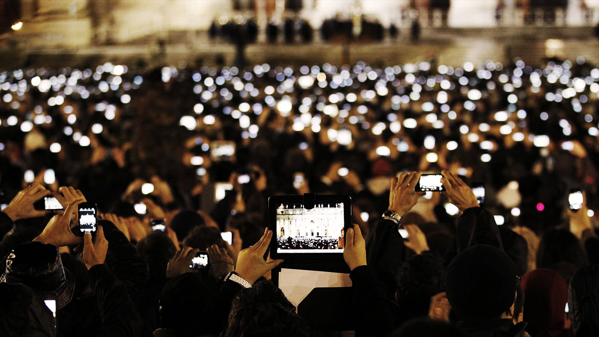

import { Blockquote } from 'components/ContentBlocks'

전시회나 공연을 보러 다니다 보면 종종 사진촬영이 금지된 경우가 있다. 입구에서 예상치 못한 촬영금지 안내문을 발견할 때면 아쉬운 마음이 우선 들지만, 돌이켜보면 오히려 촬영이 금지된 전시들을 더 집중해서 오랫동안 감상했던 것 같다. 기록할 수 없다는 불안함 탓이었을지, 아니면 관람에만 집중할 수 있었기 때문일지는 알 수 없지만 말이다.

도널드 노먼의 저서 ‘[Turn Signals are the Facial Expressions of Automobiles](https://read.amazon.com.au/kp/embed?asin=B00QFJSEWQ&preview=newtab&linkCode=kpe&ref_=cm_sw_r_kb_dp_lkb9DbMDMTKPH)’에는 한 초등학교 연극 행사에서 자녀의 모습을 촬영하기 바빠 정작 연극은 감상하지 못하는 부모들에 대한 이야기가 나온다. 그들은 집으로 돌아가 녹화된 테입을 재생하며 그제야 스크린을 통해 자녀의 연극을 감상할 수 있었을 것이다.

90년대 초반에 출간된 책이다 보니 디지털이라는 개념이 거의 생략되어 있고 비디오 테입과 인화 사진의 수명 역시 영원하지 않다는 점이 기억매체의 한계성으로 언급되기도 한다. 하지만 이렇게 기록 도구 역시 인간의 기억과 마찬가지로 영원할 수는 없었던 시절을 지나 우리는 이제 모든 것이 디지털화되어 클라우드에 보관되는 시대를 살고 있다. 우리의 기록은 이제 적어도 개념상으로는 영구히 불변할 수 있고, 얼마든 복제되어 공유될 수 있는 형태로 보관되는 것이다.

## 기록의 시대

오늘날 사람들은 저마다 주머니에 고성능 기록장치를 가지고 다니며 삶의 다양한 순간을 디지털 형태로 기록한다. 콘서트를 감상하기보다는 녹화하고, 유명인이 나타나도 직접 보기보다는 촬영하기에 바쁘고, 맛있는 음식 앞에서도 포크보다 카메라를 먼저 집어 든다. 기억할만한 순간을 카메라 렌즈에 먼저 양보하는 것은 이제 흔한 일이다. 훗날 기억의 한 챕터를 끄집어내기 위한 책갈피로서의 기록이라고 하기에는, 기록과 공유 행위 자체가 오히려 경험의 가장 큰 동기가 되는 경우가 너무 많아졌다.

하지만 가끔 너무나도 아름다운 풍경이나 행복한 순간을 맞이했을 때, 오히려 이 순간을 기록하고 싶지 않다는 생각이 들 때가 있다. 경험의 보관과 공유를 걱정하기보다는 차라리 그 순간을 온전히 체험하고 싶고, 한편으로는 그 경험이 디지털화되어 기록되고 공유되면 오히려 그 가치가 퇴색될 것만 같은 불안함도 있다. 누군가에게 내가 직접 이야기해 주고 싶은 이 경험을 디지털 파일이 문맥도 없이 전부 전달해버릴까 두렵기도 한것 같다. 사실 디지털이 되어버린 기록이 돌려줄 수 있는 보상이라고는 ‘좋아요’ 같은 단발성 자극뿐이지 않은가.

## 디지털은 기억보다 우월할까?

그렇다면 왜 사람들은 개인적인 경험을 모두 디지털화하고 있는 걸까? 디지털 포맷은 인간의 기억력이 가지고 있는 왜곡, 망각 등의 약점을 완벽히 보완하고, 개인적 경험의 공유 또한 수월하게 만드는 강점이 있다. 사람들이 끊임없이 모든 것을 디지털화하는 것은 결국 현재의 경험을 인간의 기억보다 더 나은 형태로 보관하기 위한 행위라고 이해할 수 있다. 하지만 디지털 포맷이 정말로 인간의 기억보다 우월할까? 왜곡과 망각은 단점이고, 불변하고 편리한 것은 장점일까?

우리가 정상적인 생활을 할 수 있는 이유는 과거의 기억들을 계속해서 왜곡하고 망각하기 때문이다. 인간의 기억방식이 디지털 방식과 같다면 우리는 단 한 번의 실수 또는 부끄러운 행동으로 인해 평생을 괴로워해야 할 수도 있다. 인간의 뇌 속에 저장된 기억은 그 상태로 불변하지 않고 끊임없이 재생산, 재해석된다. 과거의 기억을 재해석하는 관점은 언제나 현재다. 그러므로 과거에는 원수였더라도 지금 서로 사랑하고 있다면 괴로웠던 과거의 경험들조차도 재미있는 추억거리가 될 수 있는 것이다.

일상 속 기록행위가 증거물을 남기거나 어떤 사실을 증명하기 위함이 아니라면, 개인적 경험이 픽셀과 프레임 단위로 정확하고 불변한 형태로 기록되어야 할 이유는 마땅히 없다. 모든 것이 변화하는 세상 속에서 디지털은 불변한다는 사실 만으로도 이미 부자연스럽다. 어쩌면 삶의 순간들은 아련하고 어렴풋한 형태로 기억될 때 더 아름다울 수 있다. 훌륭한 예술작품들이 현실의 정확한 묘사에만 전념하지 않듯, 재현은 그것이 정확할 수록 주관과 감성이 들어설 자리를 배려하지 않는다.

## 경험으로서의 기록 행위

해변이나 항구 근처를 걸어 다니다 보면 캔버스 위에 풍경을 그리고 있는 사람들을 종종 볼 수 있다. 그들에게 물감과 캔버스는 기록 도구나 저장 매체가 아니다. 그림을 그리는 것은 그 행위 자체로서 훌륭하고 수준 높은 경험이다. 물을 연필로 그려보면 그 어느 때보다 물을 자세하게 관찰하고 이해하려 노력하게 된다. 마찬가지로 사진 촬영 역시 어떤 사람들에게는 그 자체로써 훌륭한 경험이다. 그들은 인간의 눈으로 인식하기 어려운 순간들을 사진으로 표현하기도 하고, 글로는 전할 수 없는 이야기를 담아내기도 한다.

이렇듯 기록은 그 자체로 훌륭한 경험이 될 수도 있다. 어떤 기록은 흔하고 반복되는 경험을 하나뿐인 값진 것으로 바꿔놓기도 한다. 습관적으로 기록되고 공유되는 수많은 디지털 노이즈와 달리, 개인의 주관이 깊이 반영된 기록은 매체의 특성을 초월한 고유의 것으로 구분될 수 있다.

## 기억의 디지털화

지난 수십 년간 세상에 존재하는 모든 사물과 개념들을 대상으로 이루어진 무분별한 디지털화는 그것이 필요했기 때문이라기보다는 그것이 가능했기 때문에 이루어졌다고 봐야 할 것이다. 사물, 직업, 삶의 방식, 그리고 우리의 경험과 기억까지도 모두 디지털화되고 있고, 테크놀로지와 디자인은 그것이 인류의 삶에 어떤 궁극적 변화를 초래할 것인지에 대한 고민 없이, 단지 실현 가능성, 사용성, 편의성 등의 측면에서 고효율만을 추구해온 것이 사실이다.

<Blockquote
  quote="Science Finds, Industry Applies, Man Conforms"
  addition="과학이 발견하고, 산업이 적용하고, 인간은 순응한다."
  name="1993년 시카고 세계박람회의 모토"
/>

사람들의 행동방식이나 습관은 개인의 선택이 아닌 시대적 강요에 의해 결정되었을 가능성이 더 크다. 우리가 디지털 네트워크를 통해 나와 전혀 관계없는 사람들과 연결되고자 SNS의 개발을 요청하지 않았듯, 우리가 스스로 삶의 수많은 순간을 불변하는 매체로서 저장하고자 고성능 기록장치와 클라우드 시스템의 개발을 요구하지 않았다. 모든 것은 그 반대의 순서로 일어났다. 어쩌면 세상의 변화 속에 자연스러워 보일 수 있는 행동방식의 변화이지만, 커다란 변화의 방향이 개인에게 끼치는 영향력을 충분히 검토하지 않은 채 진행되고 있다면, 그 속에서 우리는 어떤 것들을 놓치고 있을지 생각해 볼 필요가 있지 않을까.
