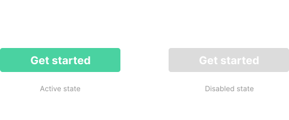
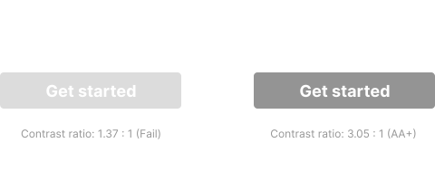

What makes a disabled state object look disabled is usually a combination of low contrast and low saturation. Thus, greyscale colours are commonly used for this purpose.

## The problem

It's a bit more complicated when the accessibility of disabled objects is considered. The purpose of the accessibility guideline on colour contrast is to avoid readability issues that are usually caused by low contrast between text and the background. The problem is basically when we use colours that pass WCAG colour contrast guidelines, it becomes too prominent to be perceived as a disabled state.

Luckily, WCAG 2.0 has noted that inactive user interface components have no contrast requirement:

<figure style="
  border: 1px solid rgba(255,255,255,0.2);
  border-radius: 4px;
  padding: 1.5rem;
  box-sizing: border-box;
  font-size: 0.8rem;
  font-family: sans-serif;
  margin: 1rem 0 2rem 0;
">Contrast (Minimum): The visual presentation of text and images of text has a contrast ratio of at least 4.5:1, except for the following: (Level AA)

  <ul style="margin-bottom: 0; font-size: 0.8rem;">
    <li>Large Text: Large-scale text and images of large-scale text have a contrast ratio of at least 3:1;</li>
    <li style="font-weight: bold;">Incidental: Text or images of text that are part of an inactive user interface component, that are pure decoration, that are not visible to anyone, or that are part of a picture that contains significant other visual content, have no contrast requirement.</li>
    <li>Logotypes: Text that is part of a logo or brand name has no minimum contrast requirement.</li>
  </ul>
  <a href="https://www.w3.org/TR/UNDERSTANDING-WCAG20/visual-audio-contrast-contrast.html" target="_blank">Link</a>
</figure>

However, there are a few more considerations needed than just colour contrast. Sean Elliott has written [an article](https://medium.com/@sean_1138/a11y-tips-disabled-buttons-and-colour-contrast-f8824d5e9610) about other things to consider for disabled objects:

- Use `disabled` or `aria-disabled` attribute for screen reader users.
- Use `cursor: not-allowed` CSS to indicate disabled state for desktop users.
- Make it clearly different from non-disabled objects, and don't just mute the colours, so that it can be perceived as disabled by colour-blind users as well.

## Edge case

There could still be an edge case where a disabled button actually need to be accessible. In that case, a different visual indicator than colour will need to be considered.

However, it's uncommon to design a disabled button with accessible colour contrast, so the design should be fully tested before implemented to confirm that users understand what the design is trying to communicate.
