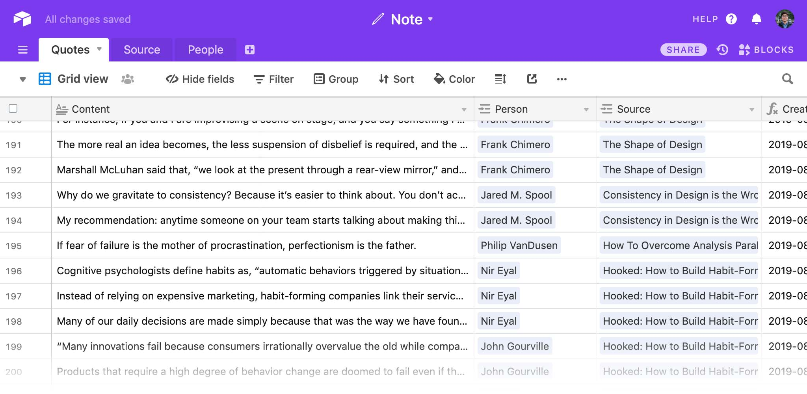
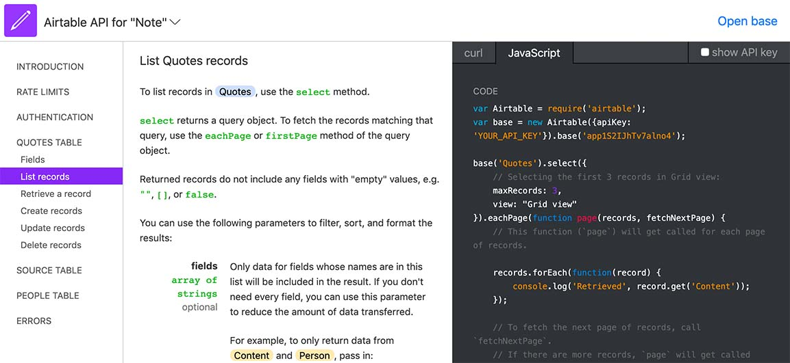

Gatsby wasn’t my first choice for developing this blog. My preference for JS framework has been Vue over React for a couple of years, although I learned React first. Reasons are nothing much. I liked Vue’s simplicity, and I didn’t like JSX.

Anyway, the initial plan was to use [Gridsome](https://gridsome.org), which is basically a Vue version of Gatsby. Gridsome, however, was still in its very early stage, so it wasn’t really comparable to Gatsby in many ways. The deal breaker was its Airtable plugin, which was added no longer than a month before I discovered it. Not surprisingly, it lacked a lot of features.

So I chose Gatsby mainly because of its [_gatsby-source-airtable_](https://www.gatsbyjs.org/packages/gatsby-source-airtable/) plugin. This plugin supports deep linking across tables, which is exactly what I needed for linking quotes table with source and author tables.

## The table

I keep memorable quotes in Airtable. They are mostly from books I read, but some are also from articles, podcasts, newsletters, magazines, YouTube videos and more.



Before Airtable, I used note apps to keep those quotes, but a standalone app is usually not flexible enough to be used as a CMS. The great thing about Airtable is its flexibility in terms of features and also the API. The API document is very easy to understand.



## The plugin

Installing and setting up the _gatsby-source-airtable_ plugin is quite straightforward. Just add the node package by yarn command:

`yarn add gatsby-source-airtable`

Then add plugin options in _gatsby-config.js_ file. For example, I have _Quotes_, _Person_, _Source_ tables under my Note Airtable.

```json
// In gatsby-config.js
plugins: [
  {
    "resolve": "gatsby-source-airtable",
    "options": {
      "apiKey": process.env.AIRTABLE_API_KEY,
      "tables": [
        {
          "baseId": "app1S2IJhTv7alno4",
          "tableName": "Quotes",
          "tableLinks": ["Person", "Source"]
        },
        {
          "baseId": "app1S2IJhTv7alno4",
          "tableName": "Person"
        },
        {
          "baseId": "app1S2IJhTv7alno4",
          "tableName": "Source"
        }
      ]
    }
  }
]
```

And as I mentioned earlier, I wanted to link _Person_ and _Source_ tables to _Quotes_ table so that I can access, for example, the name of the author, or the title of the source through _Quotes_ table. And that is why I'm using "tableLinks" option.

## GraphQL

Once the API is connected, I can query specific data with graphql. One thing I really like about GraphiQL interface is the Explorer panel on the left side. It's definitely the best data querying experience ever.


## Rendering the data

I'm not going to try explaining the basics of Gatsby template and component structure. But what I have here is basically the code for a snippet in _Note_ section in this blog. I created NoteFeed component, and passed the data returned via graphql call to this component.

```jsx
const NoteFeed = ({ edges }: Props) => {
  return (
    <React.Fragment>
      {edges.map(edge => (
        <article key={edge.node.id}>
          <p>{edge.node.data.Content}</p>
          <div>{edge.node.data.Person[0].data.Name}</div>
          <div>
            <span>
              <em>Source:</em>
              {edge.node.data.Source[0].data.Name}
            </span>
            <span>({edge.node.data.Source[0].data.Type})</span>
          </div>
        </article>
      ))}
    </React.Fragment>
  )
}
```

The NoteFeed component is basically for putting data into the right places in the layout. Then it's rendered like this:


You can have a look at the live outputs in my [Note section](/notes).
