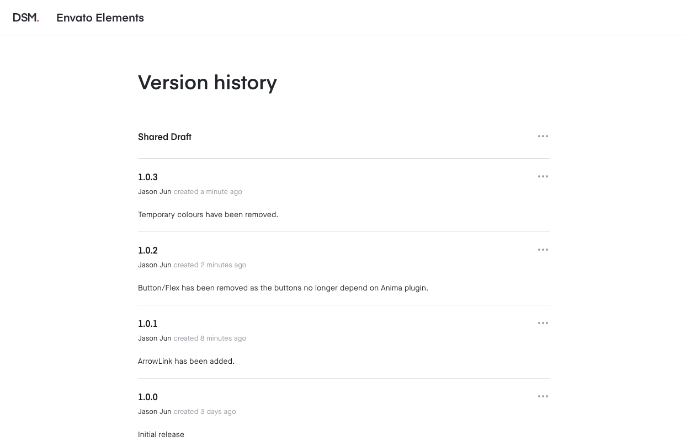

import { SmallNote, CustomCaption } from 'components/ContentBlocks'

<SmallNote>
  <strong>Note:</strong> This is a documentation of a brief workshop I did for
  UI designers at Envato in May 2019
</SmallNote>

InVision DSM is a design system management tool by InVision. Technically, it’s a part of Invision’s Sketch Plugin _Craft_, but it does much more than what plugins usually do. There are several clear advantages of using DSM for managing design systems than just using Sketch.

### Easier to navigate

Browsing styles or components is definitely easier in DSM than Sketch. The structure of the plugin is familiar and intuitive, with the tree view of the folders on the left side column and the thumbnails on the right side.

`video: adv-easy-1.mp4`

<CustomCaption video>Browing components in Invision DSM</CustomCaption>

Component thumbnails in Sketch are too small, and the components are not searchable without a third-party plugin. It might be not a huge issue when the library is relatively small, but it gets more difficult to navigate as the library grows.

### Version management

Invision DSM provides a simple version management system for your library. You can release new versions with comments, and also switch between different versions to use. The fact that I can choose when to use the next version is very helpful, especially when I am in a middle of the designing process and don't want to risk breaking something.

### Auto-generated web document

Invision DSM automatically generates web-based design system documents, which are accessible without Sketch or any tool required. Additionally, it also generates design tokens for colours and text styles. These can be used by front-end developers to sync the design and code base.

The web page updates whenever the design system in DSM is updated, saving a lot of time and effort by always keeping both design systems and the documents up to date.

## Getting Sketch library into Invision DSM

### How to create a folder

Creating a folder in DSM is very simple. Just click the _+Add Folder_ button on the bottom of the left side tree-view, then type in the name.

`video: title: "Creating a folder" create-folders.mp4`

<CustomCaption video>Creating a folder in DSM</CustomCaption>

### How to add colours

Select a colour-filled shape. Then click the _Add_ button on the bottom right corner of the DSM modal.

`video: title: "Adding colours" add-colours.mp4`

<CustomCaption video>Importing colours from Sketch</CustomCaption>

### How to add text and layer styles

To import the text and layer styles to DSM, they need to be created as a style in Sketch first. Once the styles are created in Sketch, click the _Add_ button in the Text styles or Layer styles folder to import them.

`video: title: "Adding text and layer styles": add-styles.mp4`

<CustomCaption video>Importing text and layer styles from Sketch</CustomCaption>

### How to add Sketch symbols

Select a symbol in Sketch and click the _Add_ button in DSM under the folder where you want to add the symbol. There is a description text field where you can add some comments or anything about the component.

`video: title: "Adding components": add-symbols.mp4`

<CustomCaption video>Importing Sketch symbols</CustomCaption>

## How to use Invision DSM

### How to use colours

Select the text or shape to which you want to apply the colour. Then click the colour chip in DSM.

`video: title: "Using colours": use-colours.mp4`

<CustomCaption video>Using colours from DSM</CustomCaption>

### How to use layer styles

Select the shape or object to which you want to apply the style. Then click the layer style in DSM.

`video: title: "Using layer styles": use-layerstyles.mp4`

<CustomCaption video>Using layer styles from DSM</CustomCaption>

### How to use text styles

There are basically two ways you can apply a text style. One is to click the text layer on Sketch first and then click the text style in DSM to apply. The other way is to just drag and drop the text style from DSM to the Sketch canvas and then edit the text.

`video: title: "Using text styles": use-textstyles-1.mp4`

<CustomCaption video>Using text styles - Click to apply</CustomCaption>

`video: title: "Using text styles": use-textstyles-2.mp4`

<CustomCaption video>Using text styles - Drag & drop</CustomCaption>

### How to use Sketch symbols

Just drag and drop the component you want to use from DSM to the Sketch canvas.

`video: title: "Using Sketcy symbols": use-symbols.mp4`

<CustomCaption video>Using Sketch symbols from DSM</CustomCaption>

---

InVision DSM is a very easy and intuitive tool for managing design systems with Sketch. Some limitations exist as it is a third-party plugin of Sketch. But if Sketch is your team’s main design tool, InVision DSM might be one of the best tools for creating and sharing design systems.
