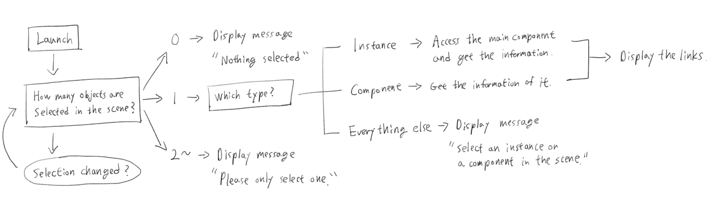
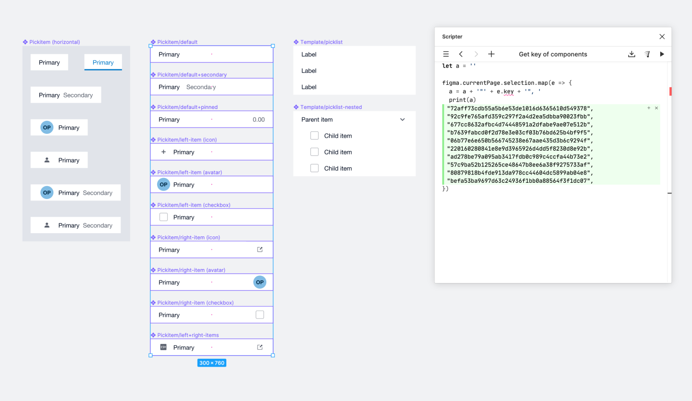
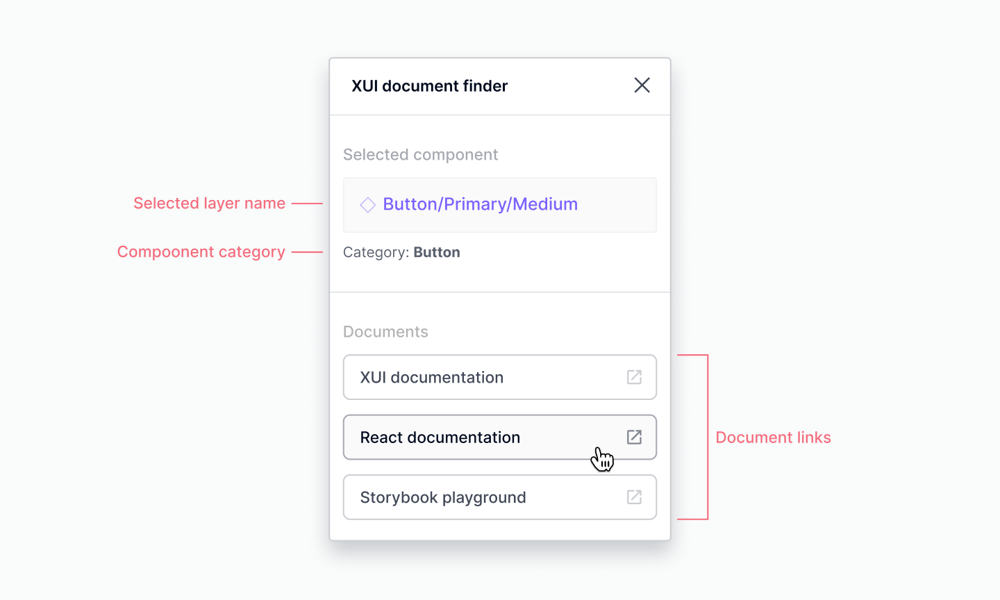

import { ImageContainer, CustomCaption, VideoContainer } from 'components/ContentBlocks'

Documentation is a crucial part of the design system. It helps designers to use component libraries accurately and confidently. However, the process of repeatedly finding relevant documents while using design tools can be cumbersome. This gap between the documentation and design tool seemed to be very suitable for a plugin to fill.

## The idea and the logic

The idea was simple: you select a component in the scene, then the plugin gives you the related documents’ links.

To do so, the plugin must be able to handle the following tasks:

- Detect the number of selected objects in the scene.
- If just one object is selected, check whether it’s an instance or not.
- If it’s an instance, access the main component and get its identifier value.
- Check if the value exists in the database.
- If it exists, get the data of the component which contains the identifier value.
- Display the links to related documents.


<ImageContainer margin="medium" noBorder noShadow noCaption>



</ImageContainer>

The note above only covers the client-side of the plugin but is enough to start designing the interface.

## Data structure

Considering what the plugin does, the data needs to contain at least two parts: Component identifier and corresponding document link. So the basic structure will be something like this:

```json
{
  "id": "component123",
  "docLink": "url"
}
```

In practice, however, this simple data structure is rarely sufficient. Considering more detailed constraints and code efficiency, the data structure becomes a little more complex.

First, a readable name for each component was needed to display in the plugin.

Secondly, according to Figma development document, the identifier that can be used to distinguish components from the library was `key`, not `id`. Also usually there are more components in the Figma library than the actual number of components in code, in order to replicate different variants and states of each component.

And lastly, In our case, we have three types of document to link: Design system documentation, React documentation, and Storybook, so the `docLink` needed to be an array with key and value.

Given the above details, the data structure should more like this:

```json
{
  "compName": "Datepicker",
  "compKey": ["comp001", "comp002", "comp003"],
  "doc": {
    "xuiDoc": "https://examplelink.com/version/datepicker",
    "reactDoc": "https://examplelink.com/react/version/datepicker",
    "storybook": "https://examplelink.com/storybook/abc123/docs/storybook/index.html?path=/story/datepicker"
  }
}
```

Then I also added `docPrefix` in the top level to avoid repeating the first part of the urls every time.

```json
"docPrefix": {
  "xuiDocPrefix": "https://examplelink.com/version/",
  "reactDocPrefix": "https://examplelink.com/react/version/",
  "storybookPrefix": "https://examplelink.com/storybook/"
}
```

### Component key collecting

The component keys are not easily accessible in Figma, so I wrote some code in Scripter to simplify this process.

```javascript
let a = ''

figma.currentPage.selection.map(e => {
	a = a + '"' + e.key + '", '
	print(a)
})
```

This simple script returns the key values of selected components in the scene in JSON-ready format, so I can just copy and paste them into the JSON file.

<ImageContainer margin="small" noShadow>



</ImageContainer>


## Interface design

The structure of this plugin is very simple, but I personally prefer to visualise the final design first rather than write markup first and trim it with CSS. In that way, I can quickly try and see different visual variations without spending too much time adjusting CSS.

<ImageContainer margin="small" noShadow>



</ImageContainer>

In terms of visual style, my intention was to make it consistent with the rest of the Figma UI, which is also the way Figma recommends in their developer document.

## Code

Figma plugin has basically two parts: The main thread Javascript file that can access anything in the scene, and the UI HTML file that can access the browser API and the network. These two parts communicate with each other by passing messages.

In our example, the main thread Javascript file contains the following tasks:

- The plugin detects selection change in the scene
- When something is selected, count the number of selected objects.
- Find out the type, layer name, and the main component’s key (if applicable) of the selected object.
- Send that information to the UI part of the plugin.

```javascript
if (selected.type === 'INSTANCE') {
  // Instance
  figma.ui.postMessage({
    type: 'selection-instance',
    message: {
      compKey: selected.masterComponent.key,
      compType: selected.type,
      compName: selected.masterComponent.name
    },
  })
} else if (selected.type === 'COMPONENT') {
  // Main component
  figma.ui.postMessage({
    type: 'selection-component',
    message: {
      compKey: selected.key,
      compType: selected.type,
      compName: selected.name
    },
  })
} else {
  // Everything else
  figma.ui.postMessage({
    type: 'selection-else',
    message: {
      compType: selected.type,
      compName: selected.name
    },
  })
}
```
<CustomCaption code>Passing a message to the UI</CustomCaption>

And the UI part handles the following tasks:

- Fetch the data from JSON file
- When component information from the main thread received, compares it against the JSON data.
- If there’s a match, return the corresponding data and display it on the plugin UI.

```javascript
React.useEffect(() => {
  window.onmessage = event => {
    // Message received from Figma
    const { type, message } = event.data.pluginMessage

    if (type === 'selection-error') {
      // Error
      setSelectionState(message)
    } else if (
      type === 'selection-instance' ||
      type === 'selection-component'
    ) {
      // Selection is an instance or a component
      setSelectionState('selected')
      setSelectionInfo({
        compKey: message.compKey,
        compType: message.compType,
        compName: message.compName,
      })
    } else {
      // Selection is not an instance nor a component
      setSelectionState('selected')
      setSelectionInfo({
        compKey: '',
        compType: message.compType,
        compName: message.compName,
      })
    }
  }
}, [])
```
<CustomCaption code>Receiving a message and update the states</CustomCaption>

## Demo

The video below shows how the plugin actually works in Figma.

<VideoContainer size="medium" margin="small" border>

`video: xuidocfinder-demo.mp4`

</VideoContainer>

