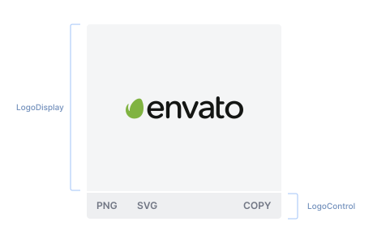
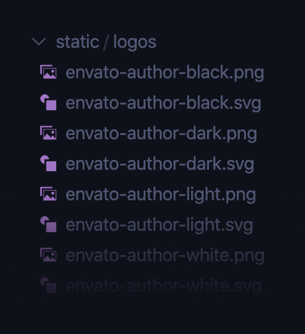

import { ImageContainer, VideoContainer } from 'components/ContentBlocks'

At Envato, we use a Slack shortcut that returns the link to a Zip file containing the logos, but it’s cumbersome to find an exact variant and format of the logo in a Zip file since we have so many logos — multiple products, sub brands, and several variations of them. So, we decided to create a web page to make this process easier.

While designing the logo box with a download button, it occurred to me that, lately, I’ve never really downloaded any SVG files. I just copy the code from the browser dev tool and paste in Figma directly. Modern design tools are smart enough to import SVG code as a vector object instead of text. So we can basically make a ‘copy‘ button that copies the SVG code to the clipboard, then paste in the design tools without worrying about the *file*.

<ImageContainer maxSize={460} margin="small" noShadow noCaption>



</ImageContainer>

## Checking SVG files, and organising file names

Before we start writing any code, we need to make sure that the SVG files are all optimised and compatible with the design tools without any glitch. Otherwise, we might get confused later in the debugging process. Additionally, the file naming convention should be consistent and clear, so they can be used within codes and are also comprehensible to people. 

<ImageContainer maxSize={240} margin="small" noShadow noCaption>



</ImageContainer>

## Injecting SVG to DOM

In order to allow SVG code to be copied, it should be injected to DOM as inline code, instead of using `` tag. And `react-svg` is a library built exactly for that purpose. 

```jsx
import { ReactSVG } from "react-svg"

<ReactSVG
  src={`/logos/${fileName}.svg`}
  afterInjection={(error, svg) => {
    if (error) {
      console.error(error)
      return
    }
  }}
  className={`logo-wrapper ${fileName}`}
/>
```

## Making file links downloadable

When an anchor tag has `download` attribute, it tells the browser to download the resource that the anchor is linked to rather than navigate to it.

```html
<a href="/logos/master-dark.png" download>PNG</a>
```

Most of the major browsers support the `download` attribute.


## Interacting with the system clipboard

There are different ways to interact with the system clipboard. We can simply use a third-party library like `clipboard.js` , or use the modern asynchronous Clipboard API. But in this example, I’m just going to use the good old `document.execCommand()` method, which is supported more widely, including older browsers.

```javascript
const copySvgCode = e => {
  e.preventDefault()

  // Get SVG code from the DOM
  const svgCode = document
    .querySelector(`.logo-wrapper.${fileName} svg`)
    .outerHTML.toString()

  // Create a temporary textarea element and write the SVG code in
  const el = document.createElement("textarea")
  el.value = svgCode
  el.setAttribute("readonly", "")
  el.style.position = "absolute"
  el.style.left = "-9999px"
  document.body.appendChild(el)

	// Select the SVG code and copy it to the clipboard
  const selected =
    document.getSelection().rangeCount > 0
    ? document.getSelection().getRangeAt(0)
    : false
  el.select()
  document.execCommand("copy")

	// Destroy the textarea
  document.body.removeChild(el)
  if (selected) {
    document.getSelection().removeAllRanges()
    document.getSelection().addRange(selected)
  }
}
```

We can also simply change the copy button label by using the State Hook.

```javascript
const [copyLabel, setCopyLabel] = useState("COPY")

const copySvgCode = e => {
	setCopyLabel("Copied!")

	setTimeout(() => {
	  setCopyLabel("COPY")
	}, 1200)
}
```

### Page preview

<VideoContainer margin="small" border>

`video: envato-logo-downloads.mp4`

</VideoContainer>

You can also check out the Envato logo assets page [here](https://envato.github.io/envato-design-resources/).
