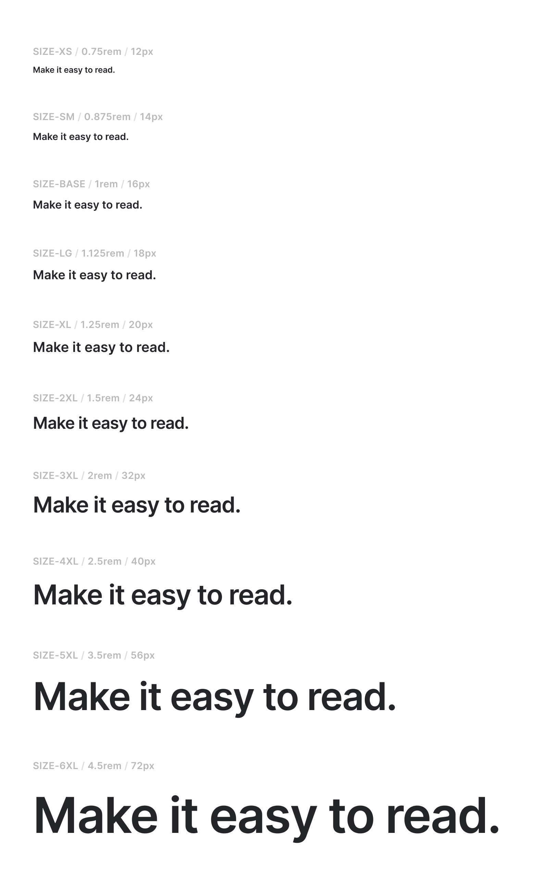
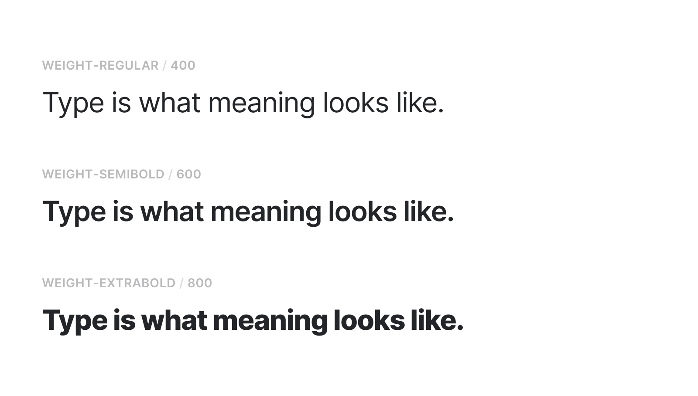
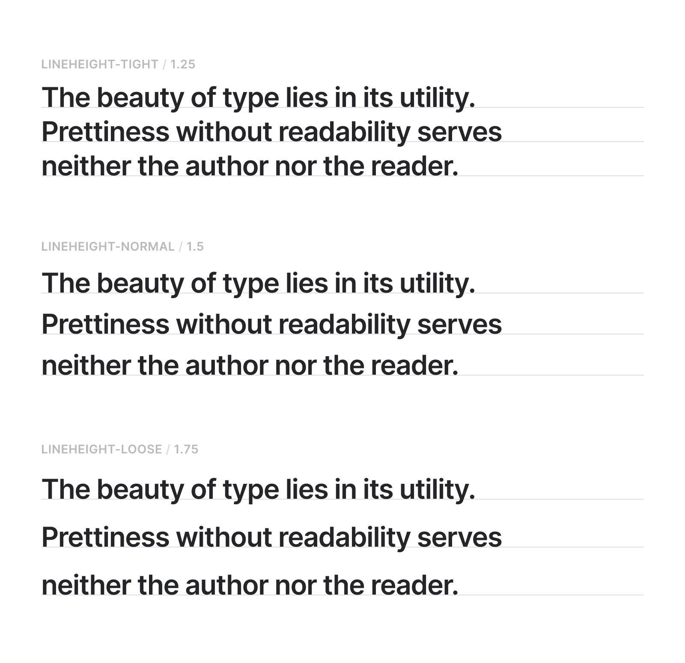
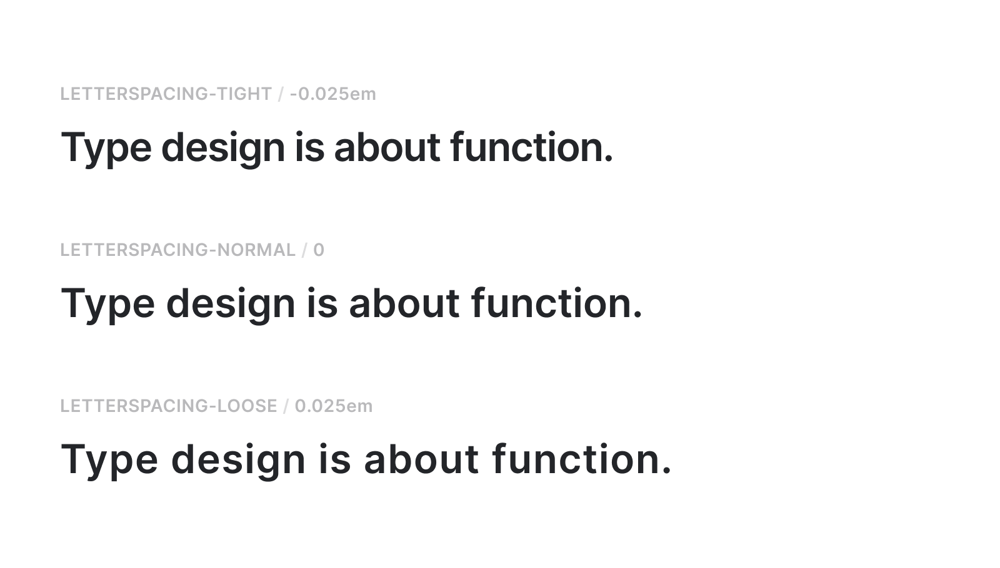
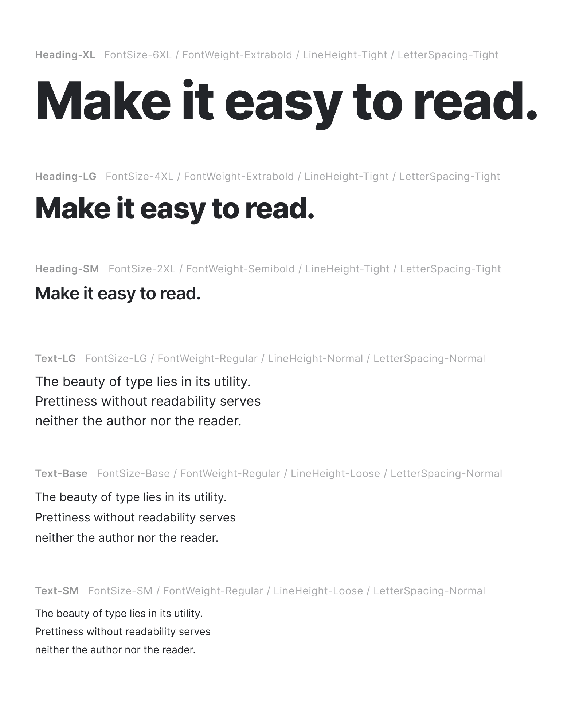

import { ImageContainer } from 'components/ContentBlocks'

A systemic design approach often ends up with a set of rules that are too rigid or too flexible, probably because finding the balance is one of the most difficult parts of it. Ironically, both cases are a major cause of visual inconsistency. If the rules are too rigid, they are apt to be ignored in practice because they can't cover so many contextual scenarios. On the other hand, if the rules are too flexible, the design is basically allowed to be fragmented.

As always, there's no _one size fits all_ kind of solution, so setting up the constraints should be started by observing the current design process of your team. When possible, it is always better for the constraints to be extracted from the existing designs rather than created separately. The more we respect the existing designs, the better the chances the newly proposed rules can be adopted.

Implementing a typography system consists of two parts on a high level. First, determine the constraints and create presets with them. Second, turn the constraints into design tokens and the presets into components.


## Text style and semantic markup

Using semantic markup is crucial for the web, but the semantic structure doesn’t necessarily need to be bound together with visual hierarchy. There are many cases where the styles and heading numbers should be considered separately. For example, using a `<h1>` for the title on an item page makes perfect sense in terms of document hierarchy and SEO, but it doesn’t need to be the largest possible font size, especially if the title can get very long. This is actually a very common issue and usually ends up leaving a lot of overwritten CSS all over the website. To prevent this, text styles should be separated from the semantic structure.

## Text property tokens

Without a predefined set of rules provided, designers can only improvise, which is one of the major causes of text style inconsistency. Sizes, weights, letter spacing, and line heights are the four main properties we use to design type on the web. Storing low-level values of these properties in design tokens is a great way to maintain a scalable and consistent typography system.

### Sizes and weights

Building a type scale can feel arbitrary without a base value. It is common and reasonable to use 16px as a base, which is a default font size in major web browsers. From there, we can create a scale system by multiplying numbers to the base value. There's no right or wrong values, but the general rule of thumb is that we need more of the smaller sizes than the larger ones. Also, try to avoid getting fractional pixel values. I personally like to start from Steve Schoger's example from [Refactoring UI](https://refactoringui.com/) and adjust it to my needs.

```js
const textSize = {
  xs: "0.75rem", // 12px
  sm: "0.875rem", // 14px
  base: "1rem", // 16px
  lg: "1.125rem", // 18px
  xl: "1.25rem", // 20px
  xl2: "1.5rem", // 24px
  xl3: "2rem", // 32px
  xl4: "2.5rem", // 40px
  xl5: "3.5rem", // 56px
  xl6: "4.5rem", // 72px
}

const textWeight = {
  regular: 400,
  semibold: 600,
  extrabold: 800,
}
```

<ImageContainer noShadow>



</ImageContainer>

<ImageContainer noShadow>



</ImageContainer>

### Letter spacing and line heights

Letter spacing and line heights should be relative values based on the text size - otherwise, the text style rules can get too complicated. In this example I set three values - tight, normal, loose - for both letter spacing and line heights. I think this is the minimum amount of flexibility needed to cover different design contexts. Choosing between `1.46` and `1.52` for line height might be unnecessary time spent, but we need at least 'tight' or 'loose' options to choose.

With line height, we can use a number value like `1.5` which means 150% pixel value of the text size. It's a little more tricky with the letter spacing because we can't use a number value here, so we need to use `em` unit to set the value as a relative to the text size. 1em is the default 100% letter-spacing, so `-0.025em` is the same as -2.5% letter-spacing.

```js
const textLetterSpacing = {
  tight: "-0.025em",
  normal: 0,
  loose: "0.025em",
}

const textLineHeight = {
  tight: 1.25,
  normal: 1.5,
  loose: 1.65,
}
```

<ImageContainer noShadow>



</ImageContainer>

<ImageContainer noShadow>



</ImageContainer>

## Text style presets

Text presets are reusable components built using a combination of text property tokens. They are predefined starting points for designers to speed up the design decisions, but also offer some flexibility with the switchable properties. For example, I can use `Heading-XL` as is, but can also use it along with `FontWeight-Regular` if that suits the context better.

One of the main benefits of creating presets with token-based properties is that they are systemically manageable. In the example below, I made three headings and three paragraphs styles, but again, the number of presets and the styles can be tailored to your specific needs.

<ImageContainer noShadow>



</ImageContainer>


## Presets to styled components

The component structure depends on how the presets are configured. In the case of my example, the presets are largely divided into two groups - headings and paragraphs - so, I'm going to create just two components, one for headings and one for paragraphs. The example given below is a styled component for heading presets.

```js
const HeadingPreset = styled.div`

  // Handle size props
  ${props => props.size === "xl" && css`
    font-size: ${textSize.xl6};
    font-weight: ${textWeight.extrabold};
    line-height: ${textLineHeight.tight};
    letter-spacing: ${textLetterSpacing.tight};
  `}

  ${props => props.size === "lg" && css`
    font-size: ${textSize.xl4};
    font-weight: ${textWeight.extrabold};
    line-height: ${textLineHeight.tight};
    letter-spacing: ${textLetterSpacing.tight};
  `}

  ${props => props.size === "sm" && css`
    font-size: ${textSize.xl2};
    font-weight: ${textWeight.semibold};
    line-height: ${textLineHeight.tight};
    letter-spacing: ${textLetterSpacing.tight};
  `}

  // Handle weight overwrite
  ${props => props.weight === "regular"
    ? css`
        font-weight: ${textWeight.regular};
      `
    : props.weight === "semibold"
    ? css`
        font-weight: ${textWeight.semibold};
      `
    : props.weight === "extrabold"
    ? css`
        font-weight: ${textWeight.extrabold};
      `
    : null
  }
      
  // Handle letter spacing overwrite
  ${props => props.letterSpacing === "tight"
    ? css`
        font-weight: ${textLetterSpacing.tight};
      `
    : props.letterSpacing === "normal"
    ? css`
        font-weight: ${textLetterSpacing.normal};
      `
    : props.letterSpacing === "loose"
    ? css`
        font-weight: ${textLetterSpacing.loose};
      `
    : null
  }

  // Handle line height overwrite
  ${props => props.lineHeight === "tight"
    ? css`
        font-weight: ${textLineHeight.tight};
      `
    : props.lineHeight === "normal"
    ? css`
        font-weight: ${textLineHeight.normal};
      `
    : props.lineHeight === "loose"
    ? css`
        font-weight: ${textLineHeight.loose};
      `
    : null
  }
`
```

The component takes CSS values based on the `size` property, and the font-weight, letter-spacing, and line-height can be overwritten, if required.


### Dynamic rendering with "as" prop

One of cool features of `styled-components` is ["as" polymorphic prop](https://www.styled-components.com/docs/api#as-polymorphic-prop), which allows the component to be rendered as any HTML tag or another custom component.

```html
<HeadingPreset as="h1" size="xl">Heading XL rendered as H1 tag</HeadingPreset>
<HeadingPreset as="p" size="sm">Heading SM rendered as P tag</HeadingPreset>
```

This is an example of using the same `<HeadingPreset />` component as either `<h1>` or `<p>` tag. This makes separating visual hierarchy from semantic structure very easy.


### Overwriting styles

The preset can be customized using the optional style overwriting. The example given below uses XL size heading with letter spacing and line height values that are different to the preset defaults.

```html
<HeadingPreset as="h2" size="xl" letterSpacing="normal" lineHeight="loose">
  Overwriting letter-spacing and line-height
</HeadingPreset>
```

While allowing a preset to be overwritten may seem to be detrimental to consistency, styles will be overwritten in a different way if we don't provide a minimum level of flexibility. This way, at least the overwritten values can be managed systemically.