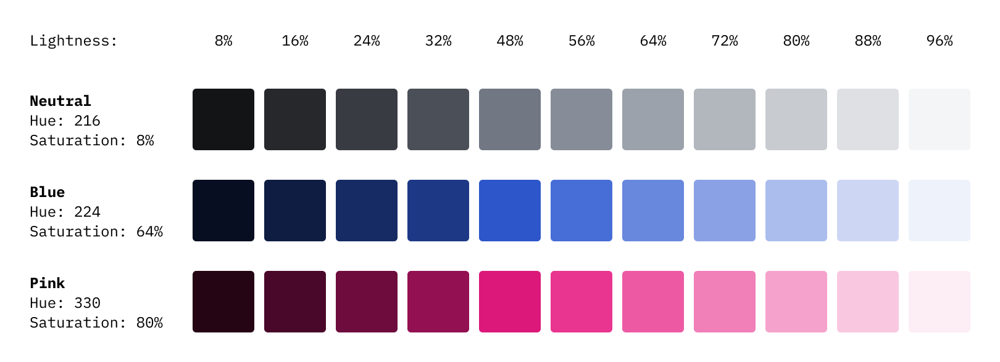

Defining colour tokens in advance might be an unnecessary constraint when you just want to quickly implement an idea. Using HSL colour is an easy way to maintain a consistent colour tone without setting up colour tokens in advance.

## Fixed Hue and Saturation

Keeping the hue and saturation and adjusting only the lightness is an easy way to maintain the colour tone while using various shades.



## HSL function with styled-component

The function takes two parameters: Colour name (string) and Lightness (number). The colour name is replaced with predetermined Hue and Saturation values, and the lightness is used as the given value. So basically the function returns CSS HSL value.

```javascript
export const hsl = (color: string, lightness: number) => {
  let hs: string

  switch (color) {
    case 'neutral':
      hs = '216, 8%'
      break
    case 'blue':
      hs = '224, 64%'
      break
    case 'pink':
      hs = '330, 80%'
      break
    default:
      break
  }
  return `hsl(${hs}, ${lightness}%)`
}
```

Use this function with styled-components:

```javascript
import styled from 'styled-components'
import { hsl } from 'src/styles'

const BlueButton = styled.button`
  color: ${hsl('blue', 96)};
  background-color: ${hsl('blue', 32)};

  &:hover {
    background-color: ${hsl('blue', 48)};
  }
`
```

The functions return CSS HSL colour values.

```css
button {
  color: hsl(224, 64%, 96%);
  background-color: hsl(224, 64%, 32%);
}

button:hover {
  background-color: hsl(224, 64%, 48%);
}
```
