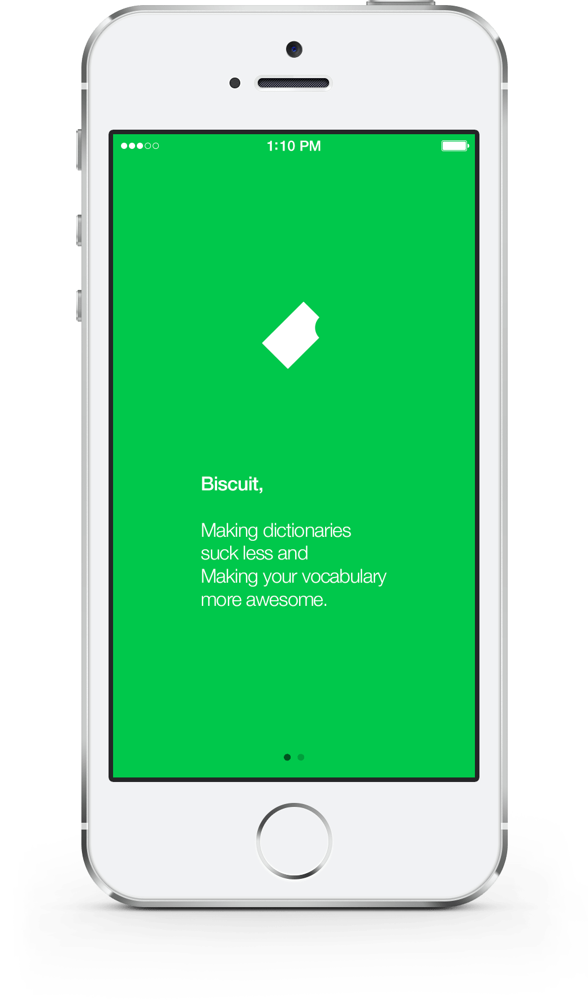
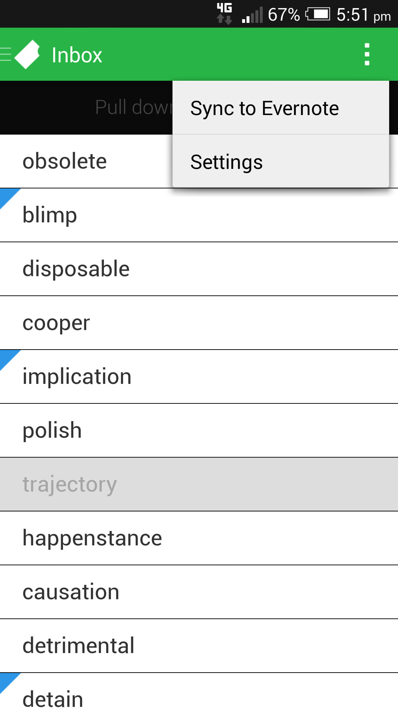
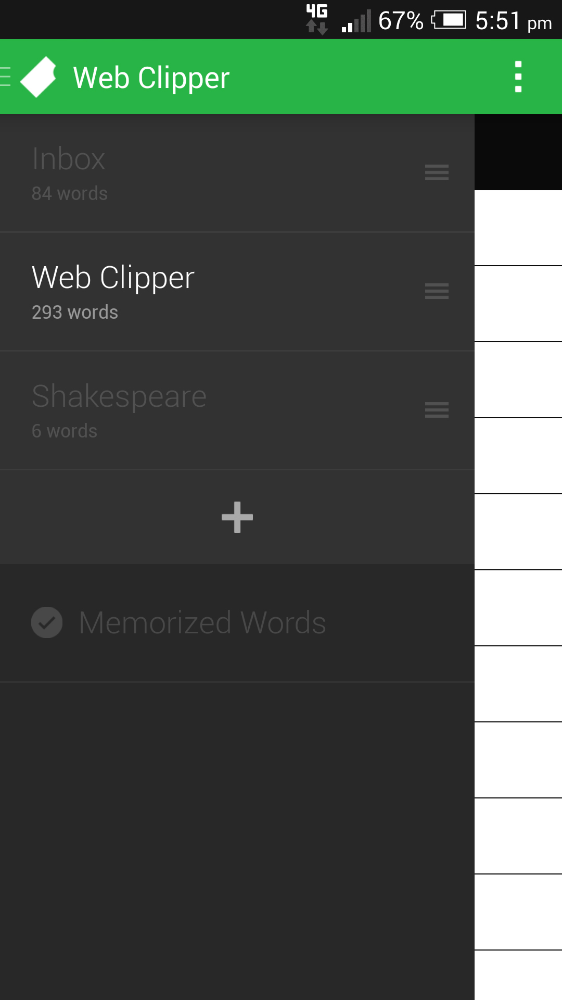
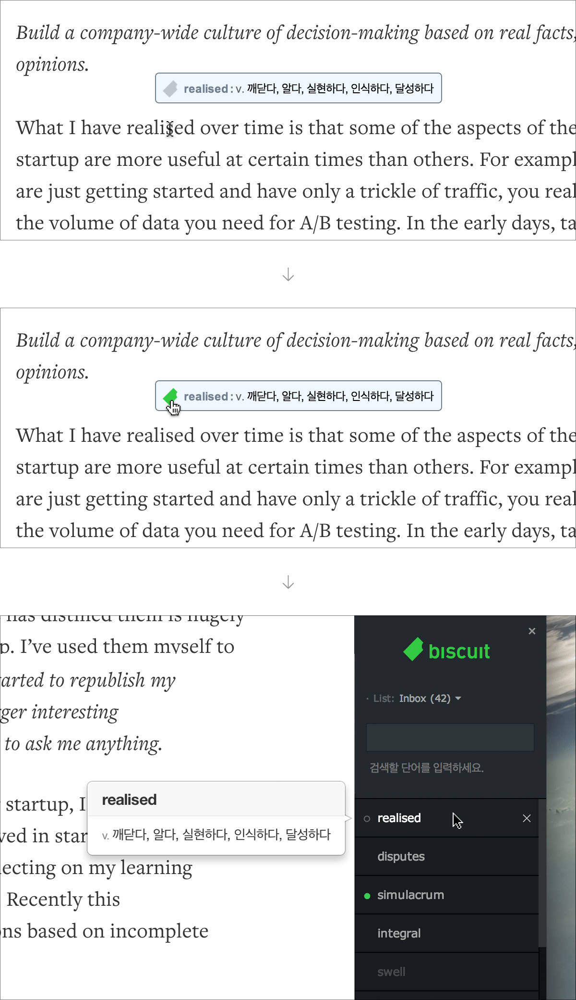
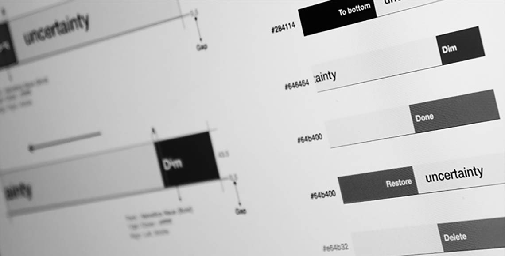

import { ImageContainer, VideoContainer } from 'components/ContentBlocks'

Biscuit is a multi-platform and cloud-based dictionary made by South Korean startup company Croquis, where I worked as a lead designer for about two years.

<ImageContainer maxSize={600} noShadow noBorder noCaption>

</ImageContainer>

We made Biscuit with the aim of creating a better dictionary that fits the mobile environment. While other dictionary apps focused on their content, we focused on the experience.

<ImageContainer grid={3} noCaption blockCaption="iOS app design">

</ImageContainer>

Mobile OSs have improved recently, but when we started this project, checking the meaning of a word in a smartphone dictionary was a really painful process. Moreover, it always required more unnecessary effort to learn the vocabulary words later.

Biscuit astonishingly reduces these painful steps using the notification center on iOS and making a definition popup for Android. When Biscuit is running in the background, the user can copy the word to check its definition and hear its pronunciation instantly.

<VideoContainer>

`vimeo: 98535214`

</VideoContainer>

An app should allow users to achieve their goal by the same amount of effort, in any device. Therefore, it’s reasonable to maintain the core part as similarly as possible, while the structure of the app should be similar to each OS's interface that the users are already comfortable with.

<ImageContainer noShadow noBorder>

</ImageContainer>

<ImageContainer grid={3} noCaption blockCaption="Android app design">

</ImageContainer>

The logo is designed to be simple, clear, and geometric instead of being too descriptive about the product or the name.

<ImageContainer noShadow noBorder>

</ImageContainer>

The team’s goal was to cover as many devices as possible, so we spent many time and effort to design and develop Biscuit for mobile, tablet, wearables and desktop.

<ImageContainer noShadow noBorder>

</ImageContainer>

<ImageContainer maxSize={600} noShadow noBorder>

</ImageContainer>

<ImageContainer maxSize={280} noShadow noBorder noCaption>

</ImageContainer>

<VideoContainer>

`vimeo: 70011200`

</VideoContainer>

We wanted to make the desktop version of Biscuit as a seamless dictionary that can be used for reading articles, so we decided to develop a browser extension instead of a standalone application.

<ImageContainer>

</ImageContainer>

The desktop environment has more states than touch interfaces, such as hover and focus states. These small differences are crucial for designers to consider, because the level of understanding and the proper use of those states could decide the quality of the application.

<ImageContainer size="medium" noShadow noBorder>

</ImageContainer>

<VideoContainer>

`vimeo: 99317816`

</VideoContainer>

<ImageContainer grid={8} noCaption noShadow>

</ImageContainer>