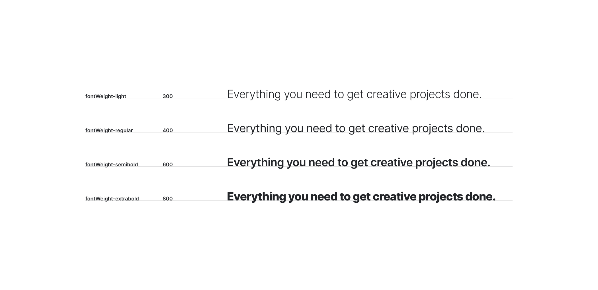

import { ImageContainer } from 'components/ContentBlocks'

I think the value of a systematic approach becomes more clear when the inefficiency of the process becomes more visible. For us, it was when we moved our main design tool from Sketch to Figma. The fact that all designers share a single file together has made the inefficient process that has existed in collaboration more visible.

## Find out previous attempts

In preparing to build the design system, we found that there have already been several attempts to create a design system at Envato. To avoid repeating the same mistakes, I first tried to figure out why the existing attempts have not continued and have been stopped.

What we learned from the previous attempts are:

- Design and development should work together from the very beginning.
- Design system is not a project, it's a product for products. And just like any other product, the quality of it doesn't matter if it's not being used.
- There's no one-size-fits-all solution. The scope and structure of the design system should be tailored to the organisation's situation.
- Focus on practicality, formality can wait.

## Setting up the environment

The first thing we did was to separate the draft and the actual library file. The draft file is where the designers explore different solutions, and the library file is the one that we use in production.

<ImageContainer maxSize={600} noShadow noBorder>

</ImageContainer>

The draft file can quickly become very messy if there's no structure. However, on the other hand, we didn't want to make too many rules for this file, because this is supposed to be a safe place to experiment. We thought that three steps — Inbox, Review, Archive — are just enough. 

The inbox section is where any designer can make a page to explore ideas or try our possible updates. The review section is for the designs that are currently in review by either designers or developers. Finally, the archive section is where we keep all the records, regardless of the result of the ideas.

<ImageContainer maxSize={640} noShadow noBorder noCaption>

</ImageContainer>

The actual library file has a pretty simple structure because, in practice, designers don't really need to open this file to use it. They can use anything in the library file in their design files via Figma's shared library feature.

## Systemic typography

While keeping the existing font sizes as the change seemed unnecessary, we wanted to solve a few issues about our typography set up:
- Text sizes are bound to document semantics.
- No clear rules on other text properties than size and weight.
- `line-height` and `letter-spacing` are in pixel value, which makes it very difficult to scale.

<ImageContainer size="large" grid={4}>

</ImageContainer>

More technical details are in [this article](/blog/2020/systemic-web-typography/) I wrote, but basically the solutions we came up with are:
- Separated text sizes from the semantic structure.
- Set up just enough constraints for text properties.
- Relative values for `line-height` and `letter-spacing`.

<ImageContainer maxSize={640} >

</ImageContainer>

## Core components

Although the way we organise components may vary slightly depending on their purpose, having consistent organising rules seemed necessary to improve long-term management efficiency.

<ImageContainer size="large" grid={2} noCaption>

</ImageContainer>

We started with buttons and input fields, and classified them into states, sizes and variations.

## Documentation

The documentation website is currently in development (as of Feb 2020), and I'm mainly working on it by myself. I'm developing it with Gatsby, and using MDX (Markdown + JSX) for the content writing.

<ImageContainer size="large" >

</ImageContainer>

In my opinion, MDX is the perfect format for writing design system documents. Just being able to import React components into a Markdown file opens a lot of possibilities for making better document.