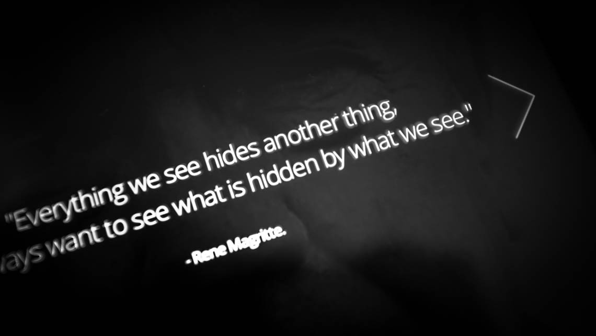

import { ImageContainer, VideoContainer, CustomCaption } from 'components/ContentBlocks'

Parallax Magritte is a web experiment to make the art works of Rene Magritte to be like 3D space, so the viewers can see the unseen part of the original painting by tilting their tablet or smartphone.

<ImageContainer noShadow noBorder noCaption>

</ImageContainer>

<VideoContainer>

`vimeo: 86180095`

</VideoContainer>

<ImageContainer>

</ImageContainer>

To build a 3D space from a plane painting, first I needed to separate each layer of the painting by using Photoshop. The tricky part of this step was filling the empty spots by copying-and-pasting from another similar part of the painting. Some layers of the painting needed to be expanded so they could have some extra space to show when the image is moving.

<ImageContainer size="medium" noBorder>

</ImageContainer>

<ImageContainer size="medium">

</ImageContainer>

Making the separated images into a 3D space using Parallax.js was mostly about sizing and positioning the each layer with CSS, so that each painting could demonstrate the best parallax effect within given boundaries.

<VideoContainer maxSize={520}>

`video: works-magritte.mp4`

</VideoContainer>

Built with Parallax.js by Matthew Wagerfield & Claudio Guglieri.

<ImageContainer grid={4} noCaption>

</ImageContainer>