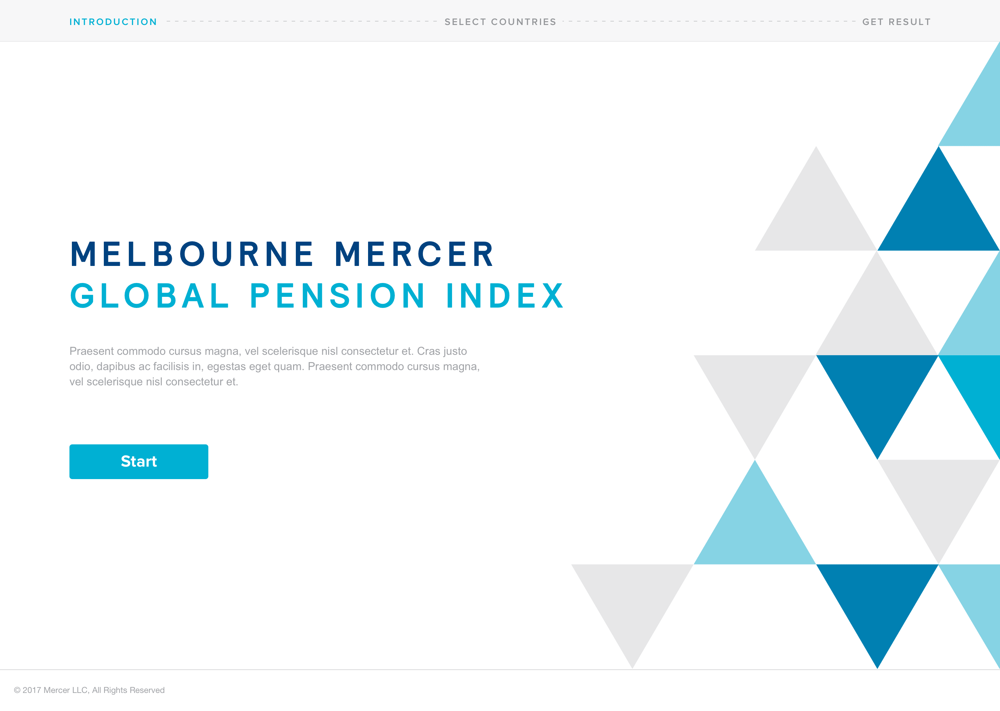
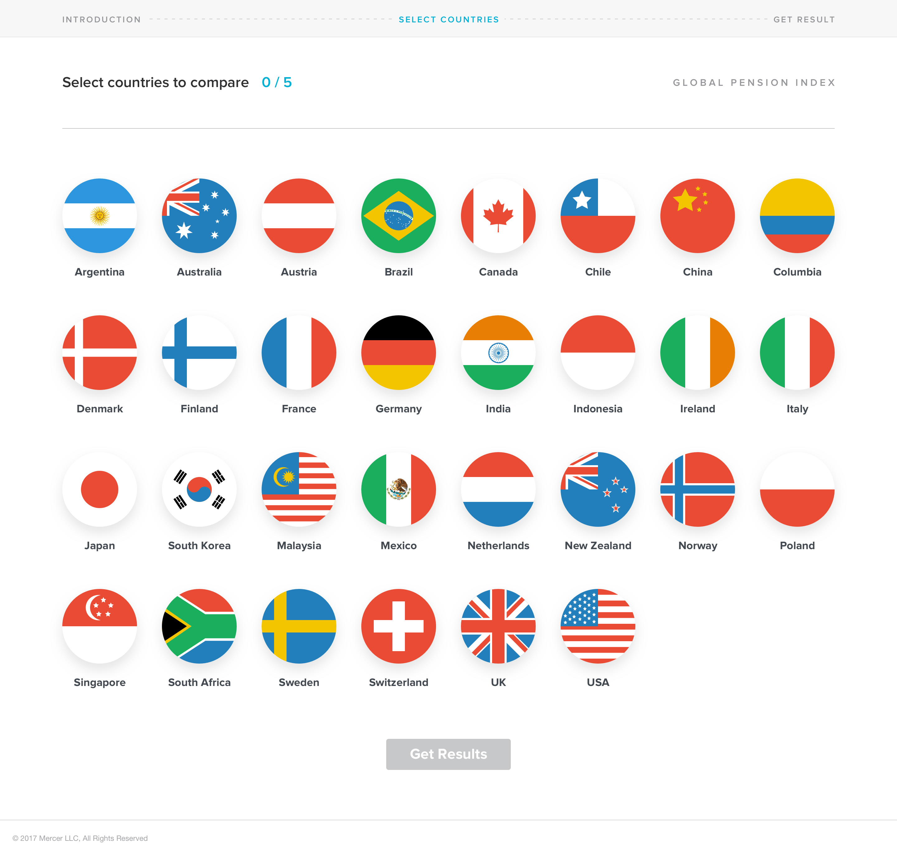
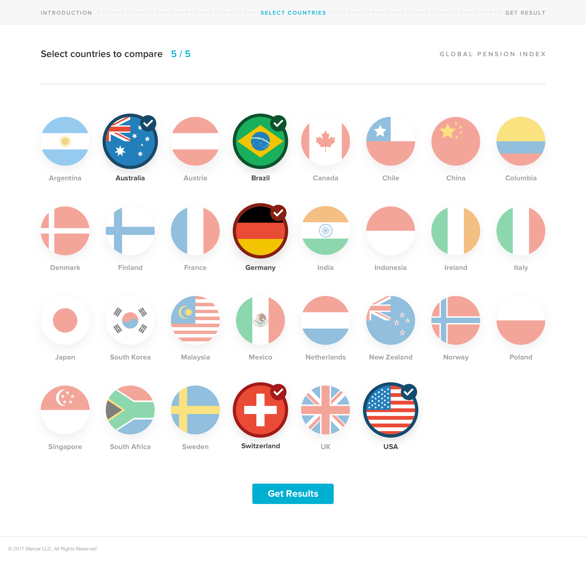
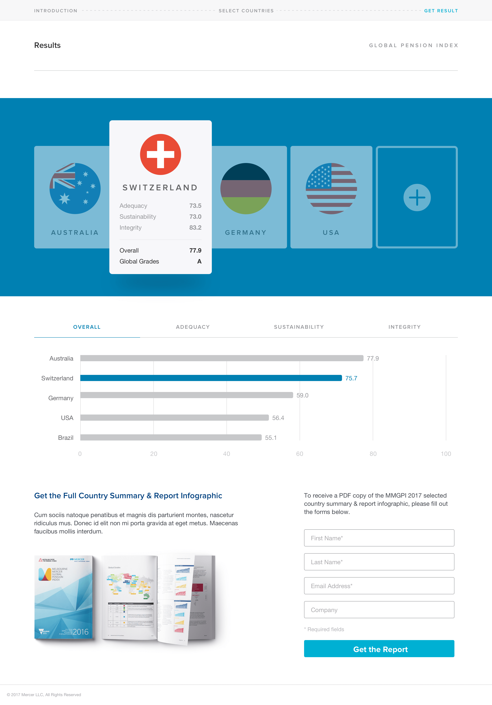
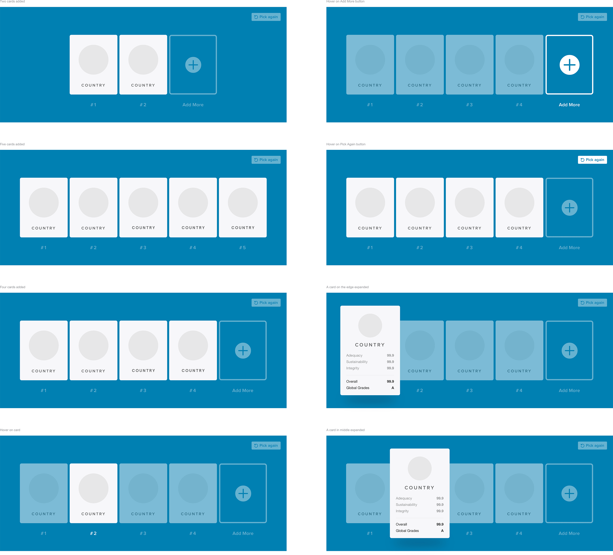
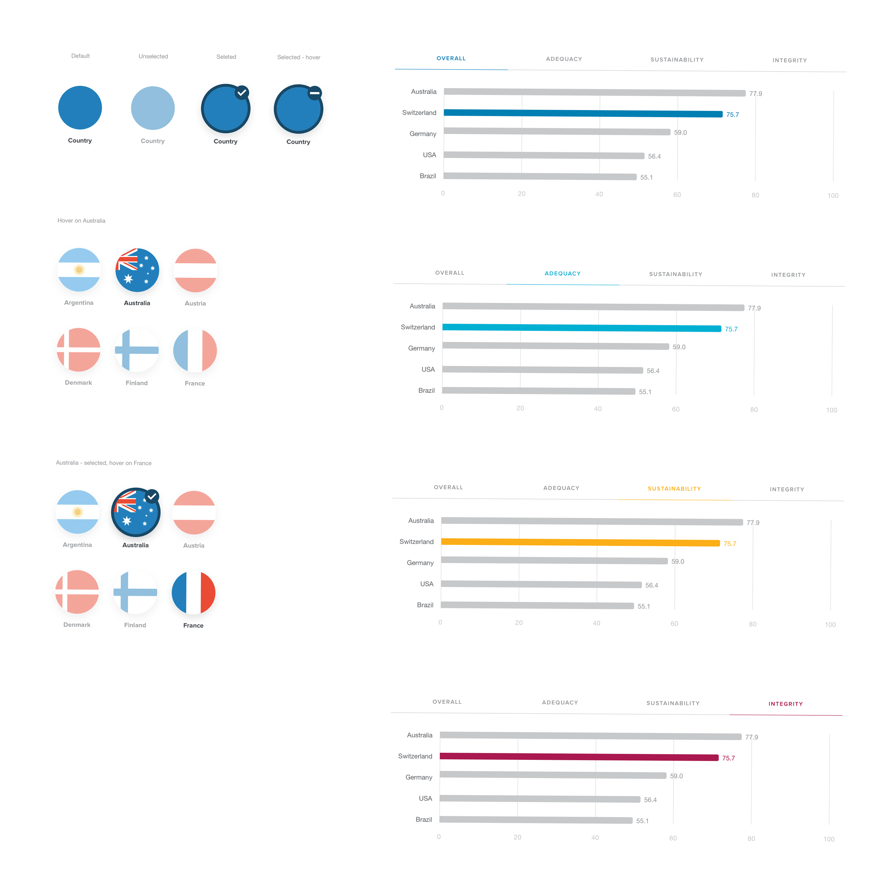

import { ImageContainer, VideoContainer } from 'components/ContentBlocks'

Mercer is the world's largest human resources consulting firm. Headquartered in New York City, Mercer has more than 20,500 employees, is based in more than 40 countries, and operates internationally in more than 130 countries.

<ImageContainer>

</ImageContainer>

<ImageContainer>

</ImageContainer>

<ImageContainer>

</ImageContainer>

The app is built on React/Redux, and most of the transitions and animations are done with the GreenSock Animation Platform.

<ImageContainer>

</ImageContainer>

Although I did both the design and front-end development, I put a lot of effort into creating high fidelity and specific designs, because this is the best communication method that I know of that helps everyone to be on the same page and discover issues prior to development.

<ImageContainer>

</ImageContainer>

<ImageContainer>

</ImageContainer>

The transitions are all designed and coded by myself. The goal was to make the overall experience more app-like, where the transition between different pages and states are seamless and natural.

<VideoContainer size="large">

`video: works-mercer.mp4`

</VideoContainer>