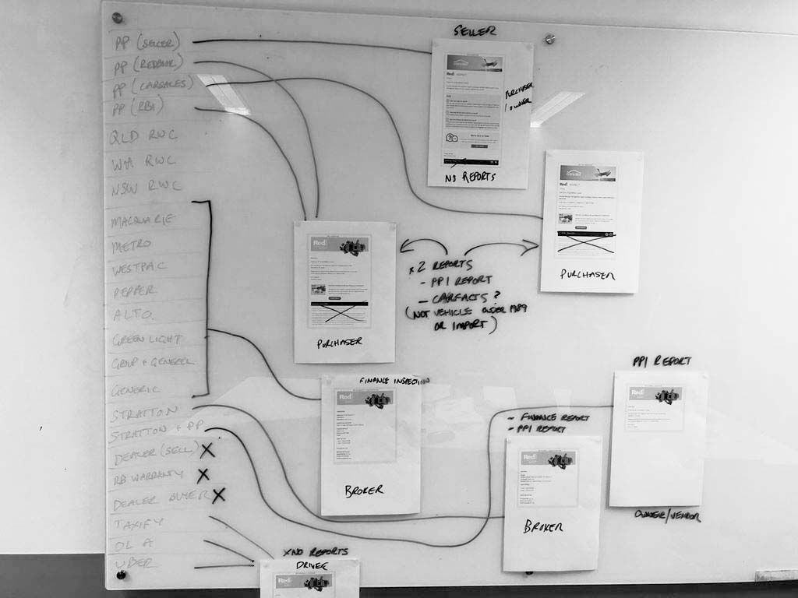

import { ImageContainer, CustomCaption, Spacer } from 'components/ContentBlocks'

Email design is often considered to be easier than webpage design because of its usualy simplicity, but it can be even trickier when you're trying to do it right. There are so many limitations when it comes to email development, thus the design also has many constraints.

Many companies use email as the main communication channel with their customers. However, keeping email designs consistent can be challenging, especially when new emails are created by multiple departments, each for specific reasons.

<ImageContainer maxSize={600}>


</ImageContainer>

RedBook Inspect has many email templates with minor differences, so redesign  ing one-by-one was not the optimal way. First, we collected all the existing emails and put them on a whiteboard to see their flow.

<ImageContainer grid={4} noCaption noShadow blockCaption="Whiteboard session">




</ImageContainer>

After the whiteboard session, I wanted to set up a digital space to continue the discussion. After some research, I found Milanote, which is a planning tool for creative projects, having many features we could use to replace the whiteboard.

<ImageContainer size="large" noShadow>


</ImageContainer>

<ImageContainer grid={2} size="large" noCaption noShadow blockCaption="Detailed email flow">


</ImageContainer>

After the team finished the discussion on the email flow and everyone was on the same page, I started redesigning the emails with Sketch. There were many repeated sections throughout the emails, so I chose to design each component and create pages by compositing the repetitive components.

<ImageContainer grid={3} size="large" noCaption>


</ImageContainer>
<ImageContainer grid={3} size="large" noCaption>


</ImageContainer>

Email development is infamous for still using 1990's coding styles, but there are many helpful tools these days that make email development much easier and more straightforward.

My choice of tools was Foundation for Emails. It had the Sass version that we wanted, and also has great documentation.

```html
---
subject: Your refund has been processed
invoice:
  title: Refunded
  refund: true
  items:
    - Finance + Pre-purchase inspection
    - Comprehensive vehicle report
  price:
    label: Total refund
    value: $265
  details:
    - label: "Reason for refund:"
      value: Outside service area
    - space: true
    - label: "Reference number:"
      value: RBI-REDBOOK-1-1
    - label: "Requestedon:"
      value: 12 December, 2016
    - label: "Booking made by:"
      value: Cynthia Dixon
  abn: "carsales.com Ltd / ABN: 12 345 678 912"
---

<container>
  <!-- Header -->
  {{> header}}

  <!-- Body -->
  <row>
    <columns small="12">
      <spacer size="60" class="spacer60"></spacer>
      <h1>{{subject}}</h1>
      <spacer size="30" class="spacer30"></spacer>
      <p>Dear Scott,</p>
      <p>Your refund has been processed. Please allow 3 to 5 business days for the funds to appear in your account.</p>
      <p>If you have any further queries you can get in touch with us on 1300 373 992.</p>
      <spacer size="60" class="spacer60"></spacer>
    </columns>
  </row>

  <!-- Refunded -->
  <hr />
  {{> invoice}}

  <!-- Footer -->
  {{> footer}}
</container>
```

<CustomCaption>Example email code</CustomCaption>

<Spacer size={64} />

```css
@import 'settings';
@import 'foundation-emails';
@import 'template/template';

/*Responsive Gutter*/
table.body td.columns, table.body th.columns{
  @media only screen and (max-width: #{$global-breakpoint}) {
      padding-left: 15px !important;
      padding-right: 15px !important;
  }
}

/*Responsive Spacer*/
// add classname spacer$i to <spacer> tag in your HTML (e.g. <spacer size="20" class="spacer20")
// choose numbers for $spacer based on what size spacer you need
$spacer: 10, 20, 30, 40, 50, 60;

@each $i in $spacer {
  .spacer#{$i} td{
    @media only screen and (max-width: #{$global-breakpoint}) {
      font-size: ($i/1.5+px) !important; // reduces spacer in half on mobile screens, customize as needed
      line-height: ($i/1.5+px) !important; // reduces spacer in half on mobile screens, customize as needed
      height: ($i/1.5+px) !important; // reduces spacer in half on mobile screens, customize as needed
    }
  }
}
```
<CustomCaption>Responsive gutter and spacer</CustomCaption>

I've spent quite a bit of effort making the actual emails look exactly the same as my initial design because the overall quality is always determined by the smallest things.
