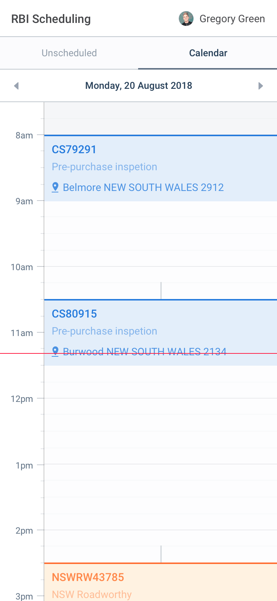
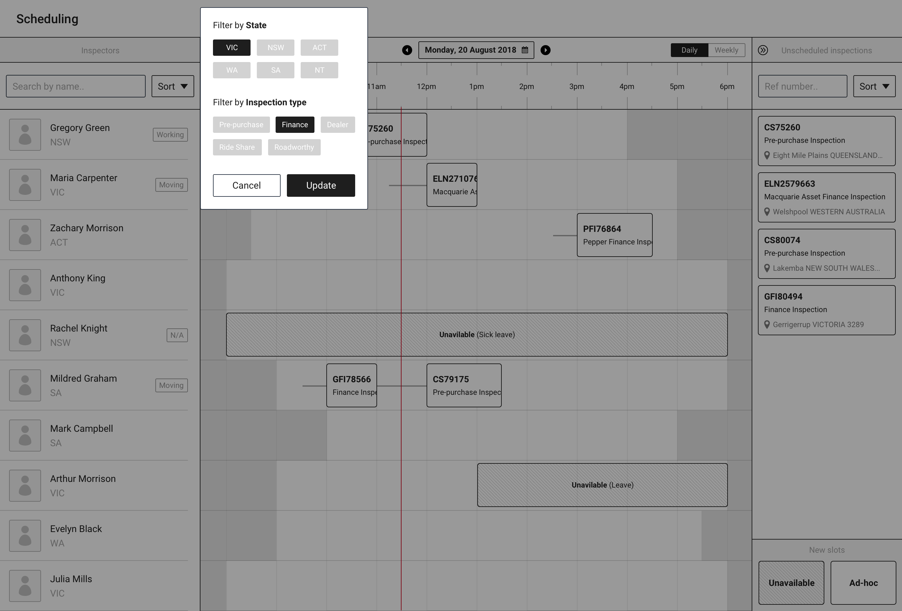

import { ImageContainer } from 'components/ContentBlocks'

The CST scheduler app is designed for the RBI customer service team to manage vehicle inspectors' schedules efficiently. So far, the customer service team has been using multiple softwares, and doing a lot of repeated tasks to manage inspectors' schedules.

We interviewed customer service team crews several times during the process and also shared the progress with them to make the tool as optimised for their processes as possible.

<ImageContainer size="large">

</ImageContainer>
<ImageContainer size="large">

</ImageContainer>
<ImageContainer size="large">

</ImageContainer>
<ImageContainer size="large" grid={2} noCaption blockCaption="Workforce filtering">

</ImageContainer>

The app is designed to be a SPA (single page application) so there's no page loading during the process, and every item of data is real-time. I tried to avoid the use of modal window UI unless it was completely necessary. Instead of modal windows, the side panel area is actively used to show information based on context.

<ImageContainer size="large" grid={2} noCaption blockCaption="Inspector view">

</ImageContainer>
<ImageContainer size="large">

</ImageContainer>
<ImageContainer size="large" grid={3} noCaption blockCaption="Inspector view - mobile">

</ImageContainer>
<ImageContainer size="large">

</ImageContainer>

Design systems methodology has been actively used in this project. The app has many repeated UIs, which means making small changes will be increasingly difficult. To prevent this and make maintaining it efficient, I made every UI element as a Sketch symbol, which can be translated to components when it's in the development phase.

<ImageContainer size="large">

</ImageContainer>

Luckily, Zeplin has started supporting design components recently. With this feature, I could easily organize design components down to atom level (based on Atomic Design by Brad Frost).

<ImageContainer size="large">

</ImageContainer>

<ImageContainer size="large" grid={6} noCaption blockCaption="Early stage wireframes">

</ImageContainer>