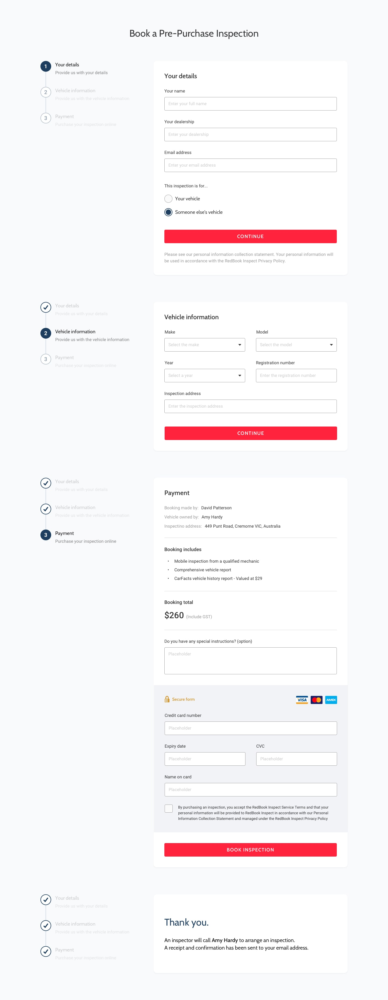

import { ImageContainer } from 'components/ContentBlocks'

RedBook Inspect is a vehicle inspection service by Carsales. They provide an inspection service, not only to individual customers, but to car dealers and finance companies. Also, a big part of the business is roadworthy inspection for drivers of ride-share services such as Uber, Ola and Didi.

One of my main projects at the RedBook Inspect team was to redesign its website. I was given enough flexibility in terms of brand and style constraints, and that was very helpful for me to think more freely without worrying too much about boundaries.

<ImageContainer noCaption>

</ImageContainer>

<ImageContainer noCaption>

</ImageContainer>

Although consistency is very important in interface design, I don't think the same design in different contexts is consistent, and that's the main reason I choose to separate the marketing side of interface design from the actual product's interface styles. Thus, more sets of typography and colours are used on this website, compared to the dynamic report.

<ImageContainer grid={2} noCaption>

</ImageContainer>

<ImageContainer grid={2} noCaption blockCaption="Page designs">

</ImageContainer>

<ImageContainer>

</ImageContainer>

<ImageContainer grid={2} noCaption blockCaption="Navigation design">

</ImageContainer>

<ImageContainer size="small">

</ImageContainer>

<ImageContainer grid={3} noCaption blockCaption="Forms design">

</ImageContainer>

<ImageContainer>

</ImageContainer>

<ImageContainer grid={3} noCaption blockCaption="Wireframes in early stage">

</ImageContainer>