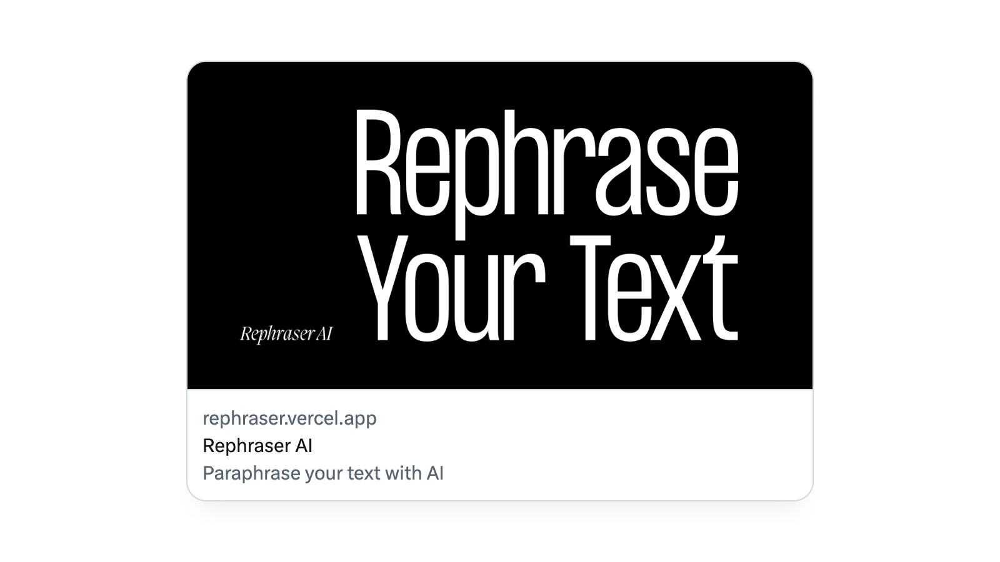

import {
  ImageContainer,
  VideoContainer,
  CustomCaption,
} from 'components/ContentBlocks'

Rephraser AI is my personal project built on OpenAI's GPT-3 API. It is designed
to generate three unique versions of any given input, which are tailored to
match the selected style and tone. It's built on Next.js and Tailwind CSS and is
hosted on Vercel. My current favourite stacks.

<VideoContainer caption="Rephraser AI">

`video: rephraser-demo-web.mp4`

</VideoContainer>

## Generating Prompt

The process of generating a prompt was more complex than I had anticipated. For
example, I found that the absence of special characters like full-stops or
question marks could result in unexpected outcomes, requiring me to address the
issue.

```js
function createPrompt({ text, style, tone }) {
  const trimmedText = `${text.trim()}${
    ['.', '?', '!', ';'].includes(text.trim().slice(-1)) ? '' : '.'
  }`
  const textWithoutLineBreaks = trimmedText.replace(/\n/g, ' ')

  const stylePrompt = style === 'same' ? '' : ` in a ${style} style`
  const tonePrompt = tone === 'same' ? '' : ` with a ${tone} tone`

  return `Generate 3 different rephrasings of the original${stylePrompt}${tonePrompt},
  prefix each with this exact symbol "$-". 
  Original: ${textWithoutLineBreaks}`
}
```

To obtain multiple variations with a single prompt, I used special character
prefixes and divided the results using Regular Expressions. I found that this
technique uses fewer tokens compared to using the `n` property
(<a href="https://platform.openai.com/docs/api-reference/completions/create#completions/create-n" target="_blank">link</a>).
Additionally, the `n` property often led to duplicated results, regardless of
the `temperature` setting
(<a href="https://platform.openai.com/docs/api-reference/completions/create#completions/create-temperature" target="_blank">link</a>).
Not 100% sure why this is the case, though.

```js
function separateResult(result) {
  const resultWithoutLineBreaks = result.replace(/\n/g, '')
  const matchArray = resultWithoutLineBreaks.match(/\$-(.*?)(?=\$-|$)/g)

  return matchArray.map((val) => val.replace(/^\$-/, ''))
}
```

## Design materials

Considering that it's only a minor side project, I didn't want to invest too
much time into the design aspect. Nevertheless, I aimed to avoid the default
Tailwind aesthetics with Inter font. So, I created some design materials using
Migra Italic and Formula Condensed, which are my owned fonts.

<ImageContainer maxSize={720} noShadow>



</ImageContainer>

<ImageContainer maxSize={720} noShadow>


</ImageContainer>

You can access the application at https://rephraser.vercel.app/. Please note
that it may often be unavailable due to an API usage limit that I've set to
minimise API fees.
