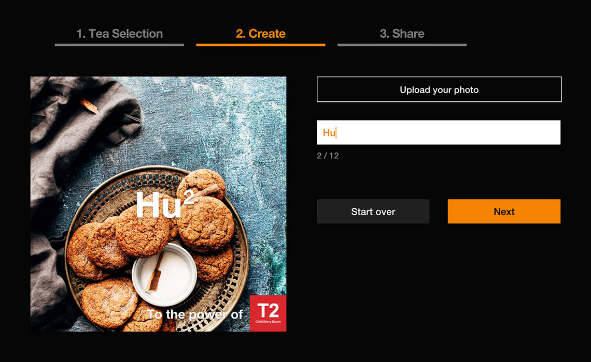

import { ImageContainer, VideoContainer } from 'components/ContentBlocks'

Originating in Australia, T2 is one of most popular tea brands now expanding globally to the UK, USA and Singapore. The Power of T2 Campaign was planned to encourage customers to share their feelings with their favorite tea.

Although the design from the client was different, our team decided to structure the app as a single page application instead of multiple pages with routing, so that it could be easily embeded into any page of the client’s existing website.

<ImageContainer size="large" grid={4} noCaption blockCaption="Tea selection flow">

</ImageContainer>

The app has been built with React and Next.js in order to generate static files to deliver to the client. The transitions between pages are all done with GSAP. The desktop and mobile are different so that the transition style fits with the layout.

<ImageContainer size="large" grid={4} noCaption blockCaption="Image creation flow">

</ImageContainer>

The actual image area is HTML5 Canvas. It generates a base64 PNG image to send to the server, which then handles the image and generates sharable pages for them.

<VideoContainer size="large">

`video: works-t2.mp4`

</VideoContainer>

<ImageContainer>

</ImageContainer>
