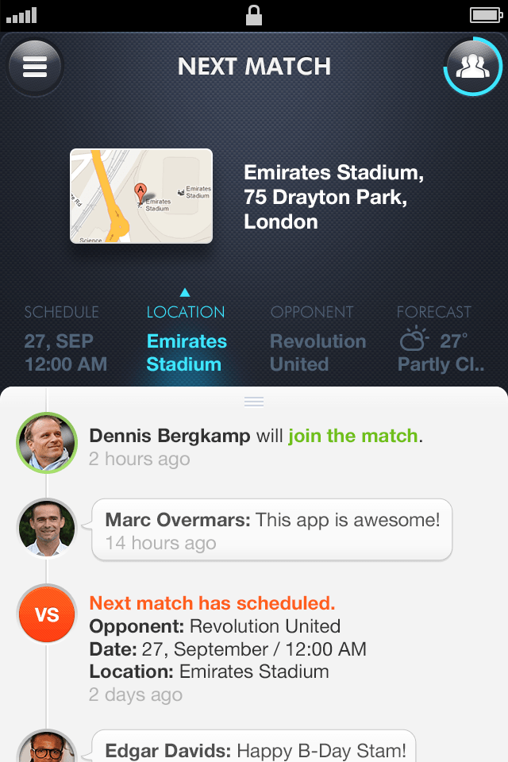

import { ImageContainer } from 'components/ContentBlocks'

Teamable is a mobile application that allows amateur athletes to easily set up matches and efficiently manage their teams.

<ImageContainer size='small' noCaption noShadow noBorder>

</ImageContainer>

Managing an amateur sports team is unnecessarily time-consuming. Every time a team has a game, the manager has to check which members can attend, mostly by texting or making phone calls. Setting up a game isn't easy either.

<ImageContainer grid={3} noCaption>

</ImageContainer>

<ImageContainer grid={3} noCaption>

</ImageContainer>

<ImageContainer size='small' noCaption noShadow noBorder>

</ImageContainer>

The process of designing Teamable was more iterative than incremental. We have continuosly done testing with couple of amateur football teams, and took the feedbacks from them seriously.

<ImageContainer grid={3} blockCaption="Earlier version of Teamable app" noCaption>

</ImageContainer>

<ImageContainer>

</ImageContainer>

<ImageContainer>

</ImageContainer>