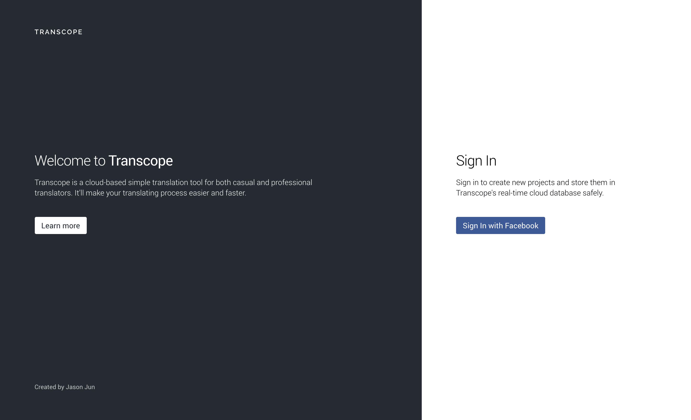
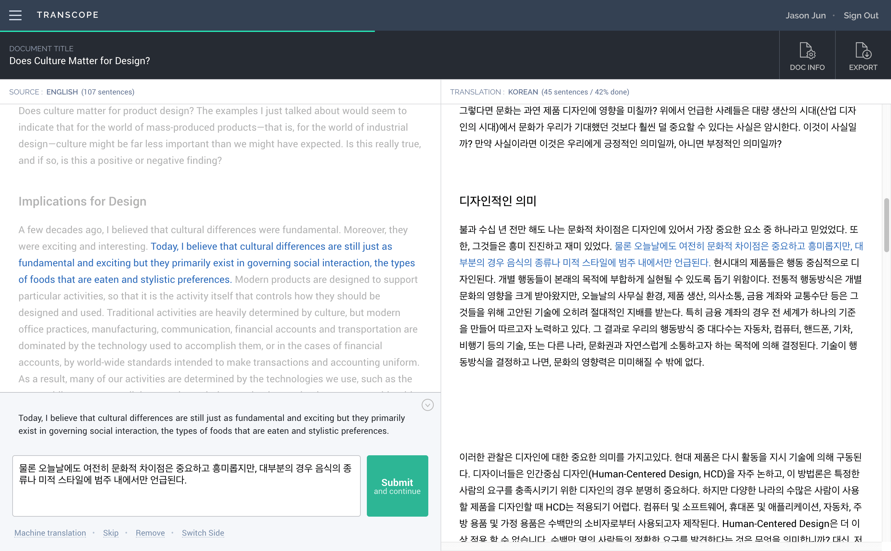
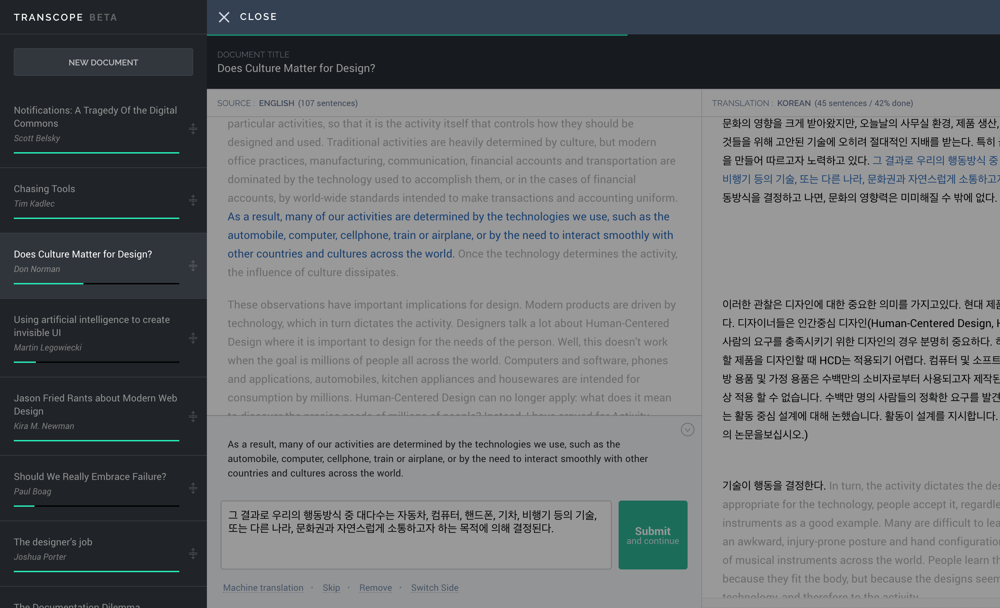
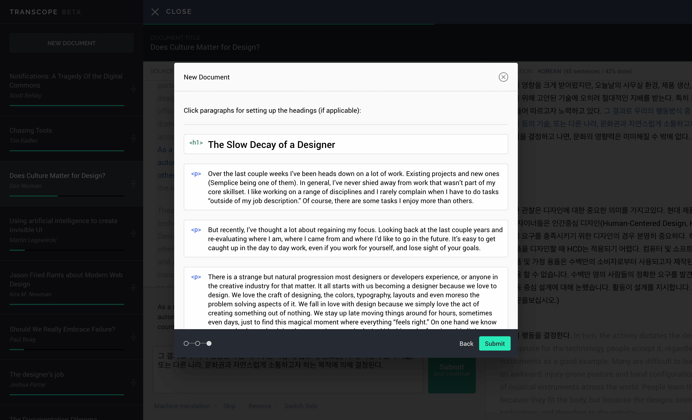

import { ImageContainer, VideoContainer, CustomCaption } from 'components/ContentBlocks'

Transcope is a cloud-based simple translation tool for both casual and professional translators. It was designed and developed by myself as a personal side project.

<ImageContainer>

</ImageContainer>

Transcope has been developed purely by Javascript, without any framework. It runs on Firebase's real-time database, which makes the loading and updating processes almost seamless.

I've also used Google Translate API to enable a Machine Translation feature, to help translators who prefer to have a starting point performed by machine, and a Word Definition feature as well.

<ImageContainer>

</ImageContainer>
<ImageContainer>

</ImageContainer>
<ImageContainer>

</ImageContainer>

I keep trying to find a balance where it's easy and obvious enough to use without an introductory tutorial, and also professional enough to be able to cover most of the translation process.

<VideoContainer ratio={1.46} caption="Transcope beta preview video">

`youtube: 30SCeywRROM`

</VideoContainer>

<VideoContainer caption="Auto scrolling">

`video: works-transcope-autoscroll.mp4`

</VideoContainer>

I know that translators don't like to use a mouse while concentrating on translating, just as developers don't like using a mouse either. One of my efforts to reduce the role of the mouse was to make the scroll automatic. It was slightly more complicated than I expected, because the length of sentences can vary. I also didn't want to fix a height position by myself, so that users would have more flexibility with their own working style.

When a user hits the enter key, the document scrolls from the current paragraph's top point to the next paragraph's top point. This ensures that the position of the activated paragraph always stays the same.

<VideoContainer caption="Creating a new document">

`video: works-transcope-create.mp4`

</VideoContainer>

With the initial version of Transcope, a document can have three different levels of formatting: Heading, Sub-heading and Paragraph. Transcope automatically divides the whole text into paragraphs and sentences, so users can work sentence by sentence. More advanced formatting options such as lists and block quotes will be supported later with updates.

<VideoContainer caption="Simple dictionary">

`video: works-transcope-word.mp4`

</VideoContainer>

Users can easily see the definitions of words that they're going to translate by just clicking the input interface. It gets the data from Google Translator API, based on the original and target languages they chose when creating the document.

<VideoContainer caption="Machine translation">

`video: works-transcope-machine.mp4`

</VideoContainer>

In most cases, the quality of machine translation isn't good enough to use as output, but it can be a starting point for translators to work on, which can save some time. Just by clicking the 'Machine Translation' link at the bottom left will get the Google Translator's results into the input field, so users can start making changes to it.

<VideoContainer caption="List sorting">

`video: works-transcope-list.mp4`

</VideoContainer>

jQuery UI is the only Javascript library that's been used while developing the initial version of Transcope that's for the drag-and-drop list sorting feature. This makes the sorting intuitive and easy.

<VideoContainer caption="Exporting document">

`video: works-transcope-export.mp4`

</VideoContainer>

Users can either copy the output to the clipboard or export it to a .txt file.
