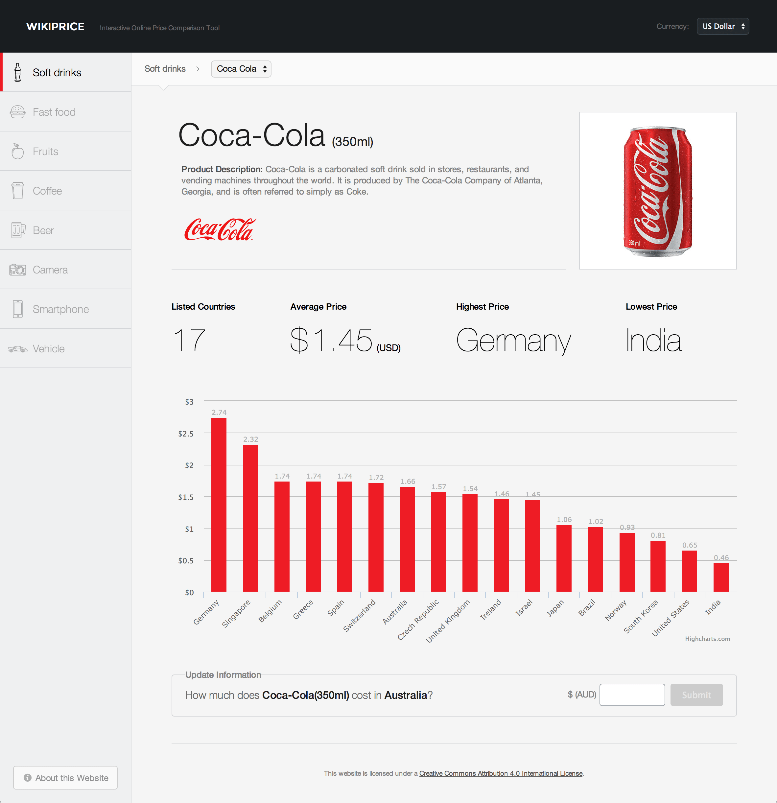
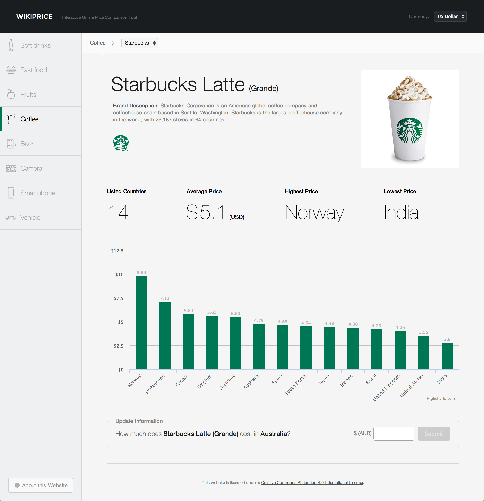
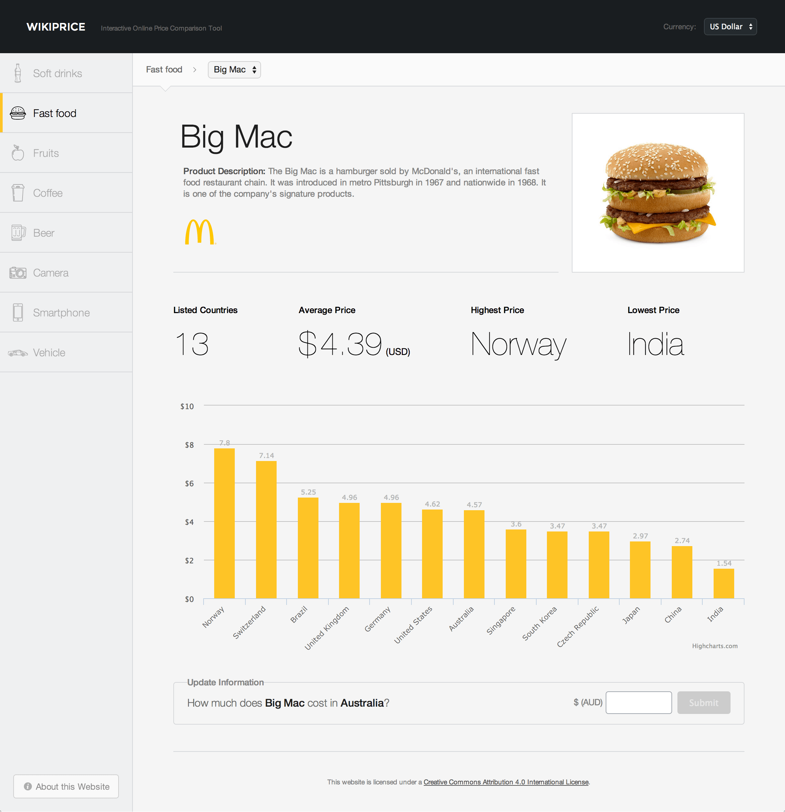
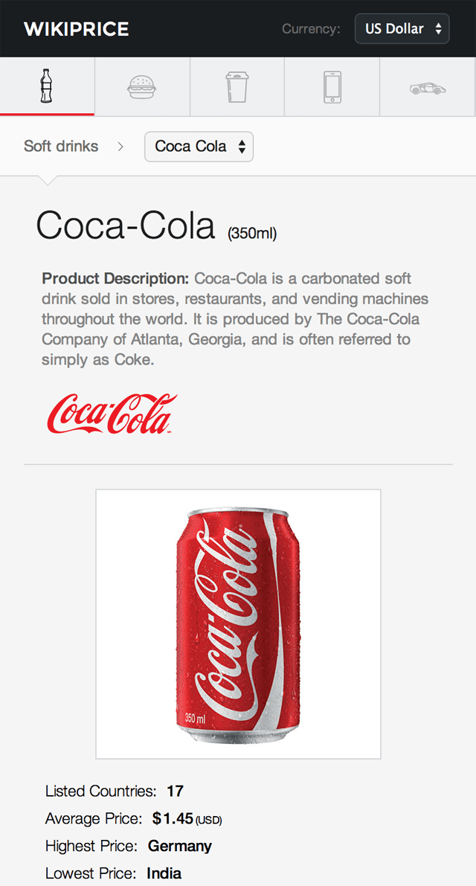
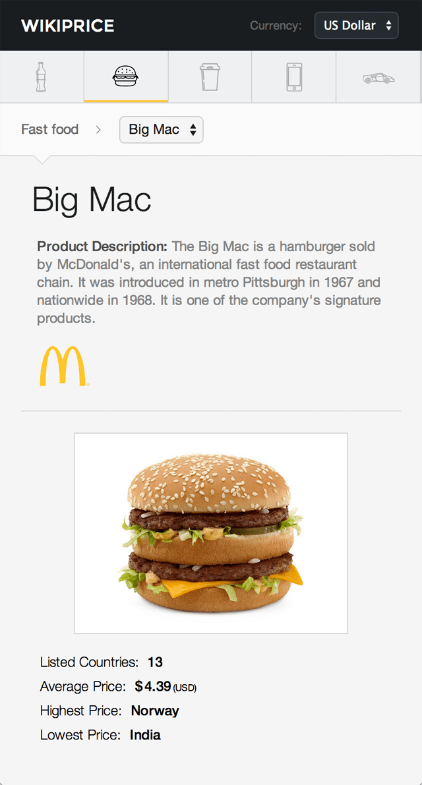
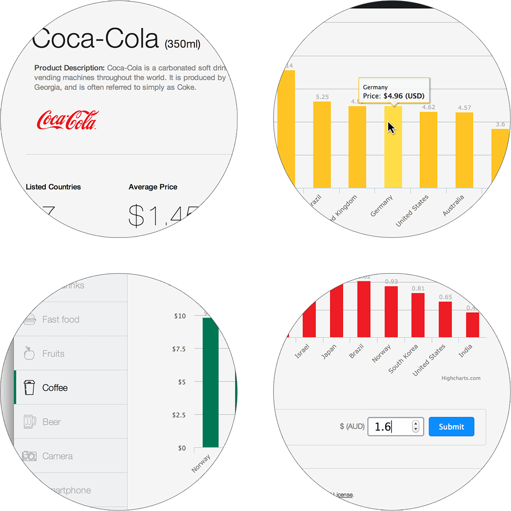
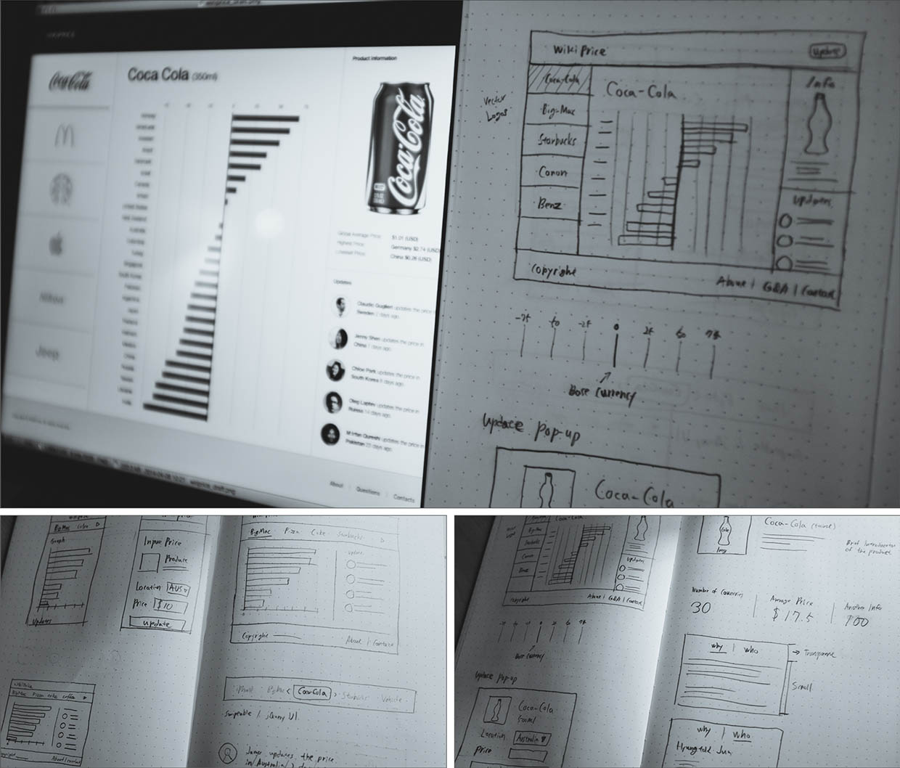

import { ImageContainer } from 'components/ContentBlocks'

Wikiprice was my major project during my last semester at Sydney Uni. The idea was to make an interactive currency comparison tool powered by people around the world, instead of some specific organisation.

<ImageContainer maxSize={280} noShadow noBorder>

</ImageContainer>

<ImageContainer noCaption>

</ImageContainer>

<ImageContainer noCaption>

</ImageContainer>

<ImageContainer noCaption>

</ImageContainer>

This price comparison index is based on the theory of purchasing-power parity (PPP). Purchasing power parity is a component of some economic theories and is a technique used to determine the relative value of different currencies.

<ImageContainer grid={2} size="medium" noCaption>

</ImageContainer>

<ImageContainer size="medium" noShadow noBorder noCaption>

</ImageContainer>

<ImageContainer noShadow noBorder>

</ImageContainer>