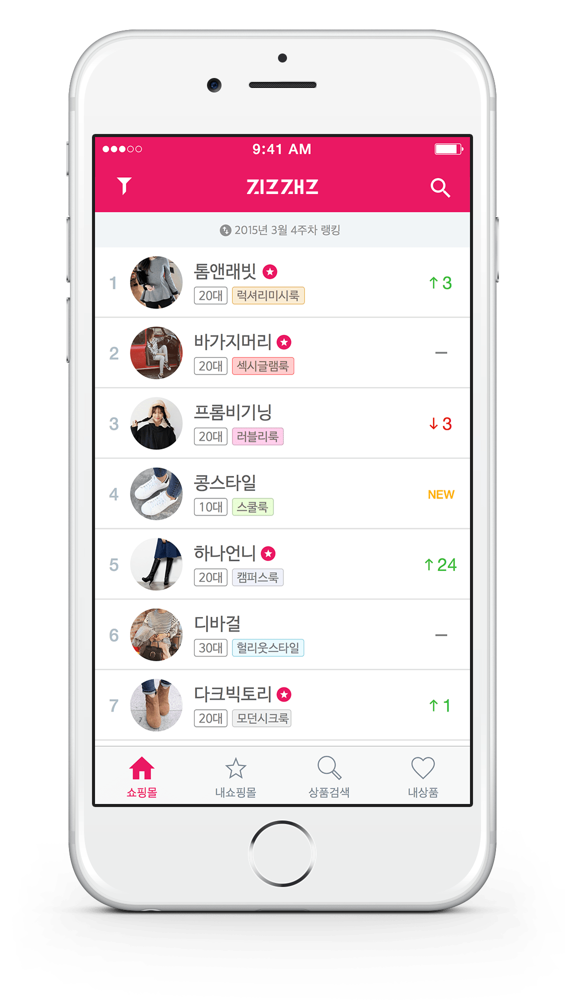
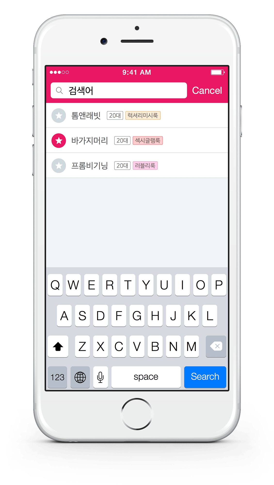
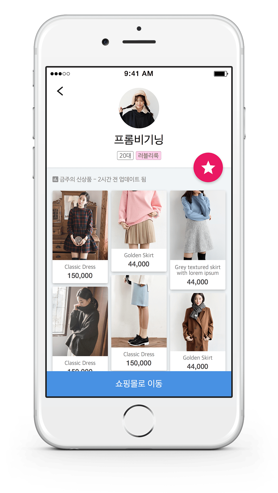
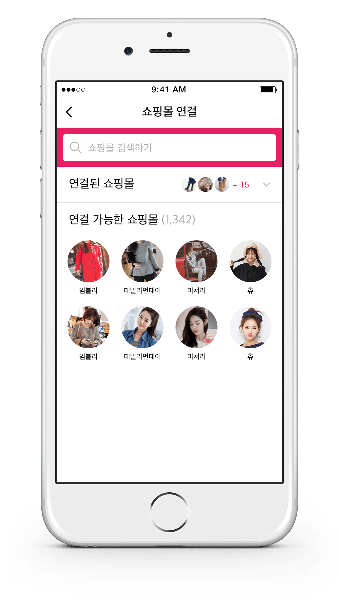
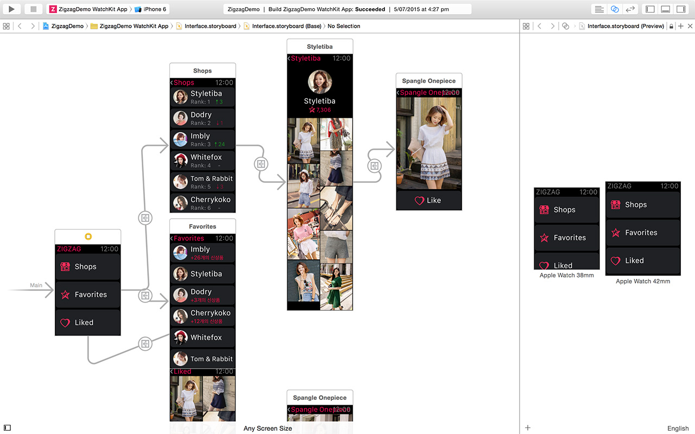
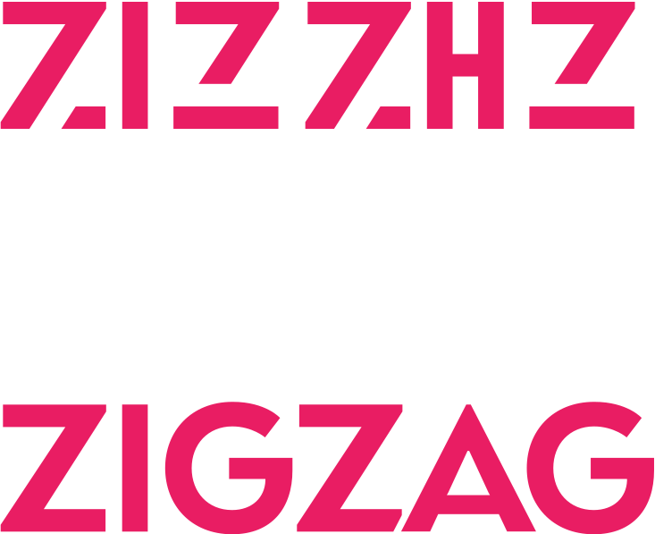
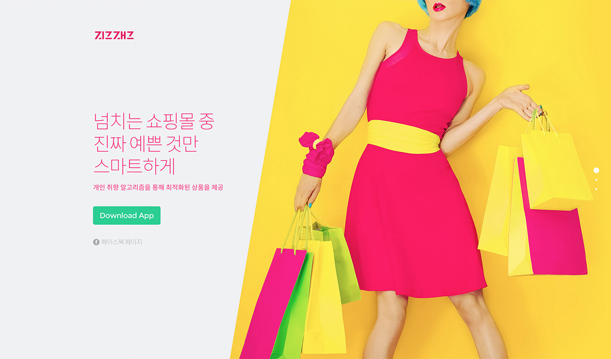
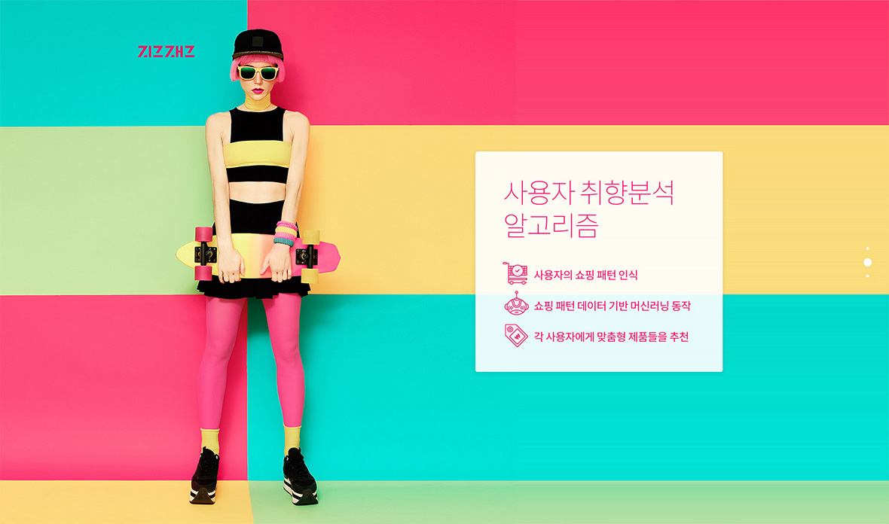
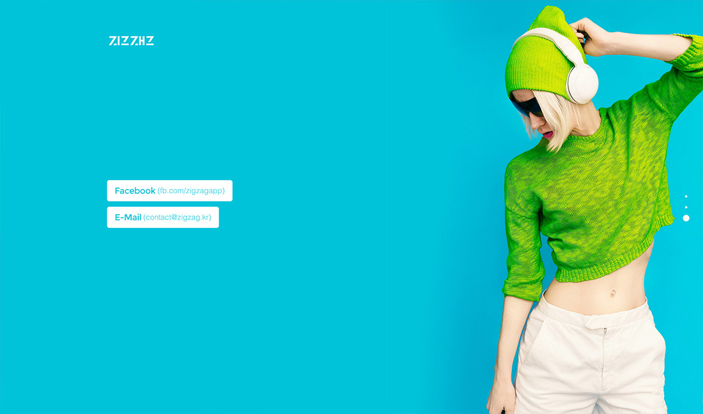

import { ImageContainer, VideoContainer } from 'components/ContentBlocks'

Zigzag is a meta fashion shopping mall app for young female users in South Korea. It was my final project at Croquis, the startup I worked for years as a lead designer.

<ImageContainer maxSize={600} noShadow noBorder noCaption>

</ImageContainer>

<ImageContainer size="large" grid={3} noShadow noBorder noCaption>

</ImageContainer>

I've created Zigzag's Watch App prototype with Xcode. It's much easier than using Framer or any other third party prototyping tool when creating a Watch App prototype.

<ImageContainer>

</ImageContainer>

<VideoContainer maxSize={280}>

`video: works-zigzag.mp4`

</VideoContainer>

I found that the word Zigzag and 지그재그(Korean name of the app) has some similarity in the visual shape and the length. So I tried to find a font that I can use for English, also can be converted to Korean word with some tweaks.

<ImageContainer maxSize={200}>

</ImageContainer>

<ImageContainer noCaption>

</ImageContainer>
<ImageContainer noCaption>

</ImageContainer>
<ImageContainer>

</ImageContainer>